# 🦙 RAG LlamaStack Application - Complete Feature Overview

> **A comprehensive breakdown of all aspects and capabilities of the RAG LlamaStack application**

---

## 📋 **Table of Contents**

1. [🎯 Core RAG Capabilities](#-core-rag-capabilities)
2. [🏗️ System Architecture](#️-system-architecture)
3. [🔧 Detailed System Design Architecture](#-detailed-system-design-architecture)
4. [🔐 Security & User Management](#-security--user-management)
5. [🌐 Web Content & Integration](#-web-content--integration)
6. [📊 User Experience & Interface](#-user-experience--interface)
7. [🔧 Development & Operations](#-development--operations)
8. [📈 Performance & Scalability](#-performance--scalability)
9. [🎨 Advanced Features](#-advanced-features)
10. [🔄 Workflow & Process Management](#-workflow--process-management)
11. [🎯 Business & Use Case Support](#-business--use-case-support)

---

## 🎯 **Core RAG Capabilities**

### **Document Intelligence & Processing**
- ✅ **Multi-format Document Support**
  - PDF, DOCX, PPTX, TXT, MD files
  - Up to 50MB file size limit
  - Intelligent format detection
  - Content extraction optimization

- ✅ **Smart Content Chunking**
  - 3000-character chunks with 600-character overlap
  - Sentence boundary preservation
  - Paragraph-aware splitting
  - Context continuity maintenance

- ✅ **Semantic Understanding**
  - Convert documents into searchable knowledge base
  - 384-dimensional embeddings using all-MiniLM-L6-v2
  - Content deduplication and validation
  - Large file handling with optimization

### **Advanced Search & Retrieval**
- ✅ **Semantic Search**
  - Vector-based similarity search using embeddings
  - FAISS index for high-performance retrieval
  - Configurable similarity thresholds (0.25 default)
  - Real-time search capabilities

- ✅ **Hybrid Search**
  - Combine file uploads and web content in unified search
  - Multi-source information synthesis
  - Source attribution and tracking
  - Context-aware retrieval

### **AI-Powered Q&A System**
- ✅ **Contextual Responses**
  - Generate answers based on document content
  - Source citations for all claims
  - Natural language question answering
  - Multi-turn conversation support

- ✅ **Intelligent Fallbacks**
  - Graceful degradation when AI models unavailable
  - Multiple AI provider support with auto-switching
  - Response quality control and validation
  - Content-based fallback responses

---

## 🏗️ **System Architecture**

### **Scalable AI Infrastructure**
- ✅ **LlamaStack Orchestration**
  - Unified API for multiple AI providers
  - Local Ollama integration for privacy
  - Model flexibility and provider switching
  - Real-time processing capabilities

- ✅ **Vector Database Management**
  - FAISS integration for high-performance search
  - Dual storage: SQLite metadata + FAISS vectors
  - Bidirectional synchronization
  - User isolation and data separation

### **Data Management & Persistence**
- ✅ **SQLite Database**
  - Reliable metadata and session storage
  - User data isolation and multi-user support
  - Chat history persistence
  - Document lifecycle management

- ✅ **Session Management**
  - User authentication and session persistence
  - Token-based session security
  - File-based session storage
  - Auto-login capabilities

---

## 🔧 **Detailed System Design Architecture**

### **🏗️ High-Level System Architecture**

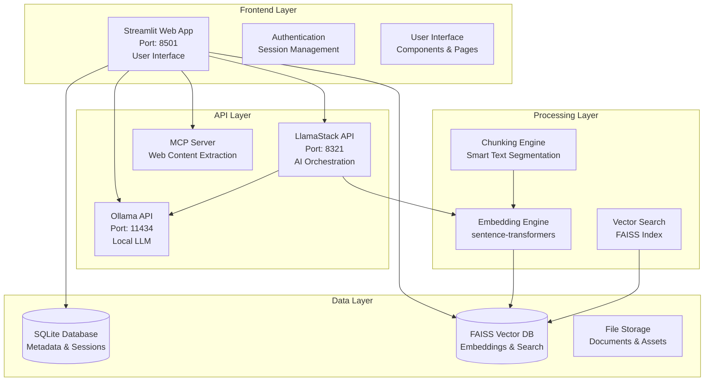

### **🔄 Data Flow Architecture**

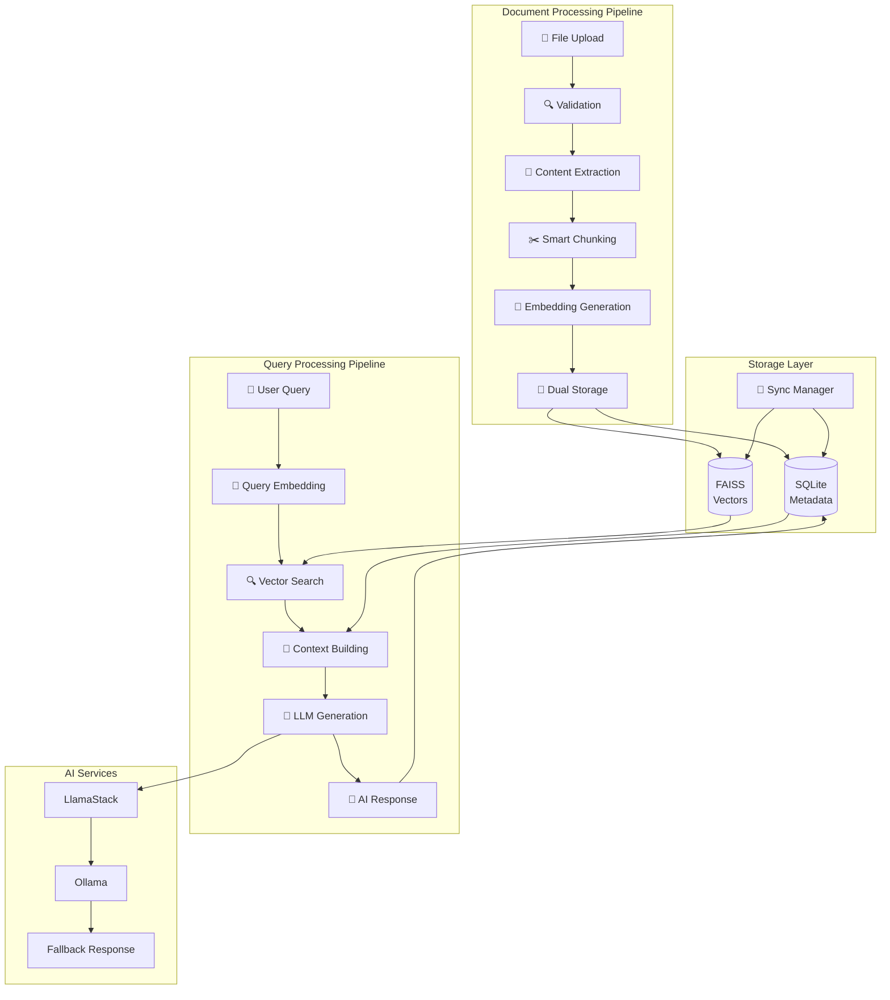

### **🗄️ Database Architecture**

#### **SQLite Schema Design**

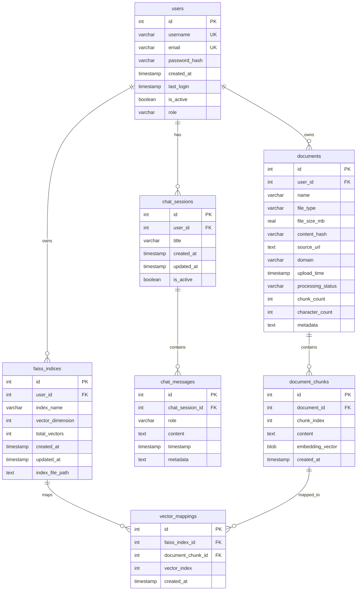

#### **FAISS Vector Database Structure**

```mermaid
graph TB
    subgraph "FAISS Index Architecture"
        FAISS_INDEX[FAISS Index<br/>IndexFlatL2<br/>384 dimensions]
        
        subgraph "Vector Storage"
            VECTORS[Vector Array<br/>float32[384] per chunk]
        end
        
        subgraph "Metadata Storage"
            CHUNKS_META[Chunks Metadata<br/>List of Dict]
            DOCS_META[Documents Metadata<br/>List of Dict]
            MAPPING[Document Mapping<br/>Dict]
        end
        
        subgraph "Search Operations"
            QUERY_VEC[Query Vector<br/>384 dimensions]
            SIMILARITY[Similarity Search<br/>L2 Distance]
            TOP_K[Top-K Results<br/>Configurable]
        end
    end
    
    FAISS_INDEX --> VECTORS
    FAISS_INDEX --> CHUNKS_META
    FAISS_INDEX --> DOCS_META
    FAISS_INDEX --> MAPPING
    QUERY_VEC --> SIMILARITY
    SIMILARITY --> TOP_K
```

### **🔧 Service Architecture**

#### **Microservices Design**

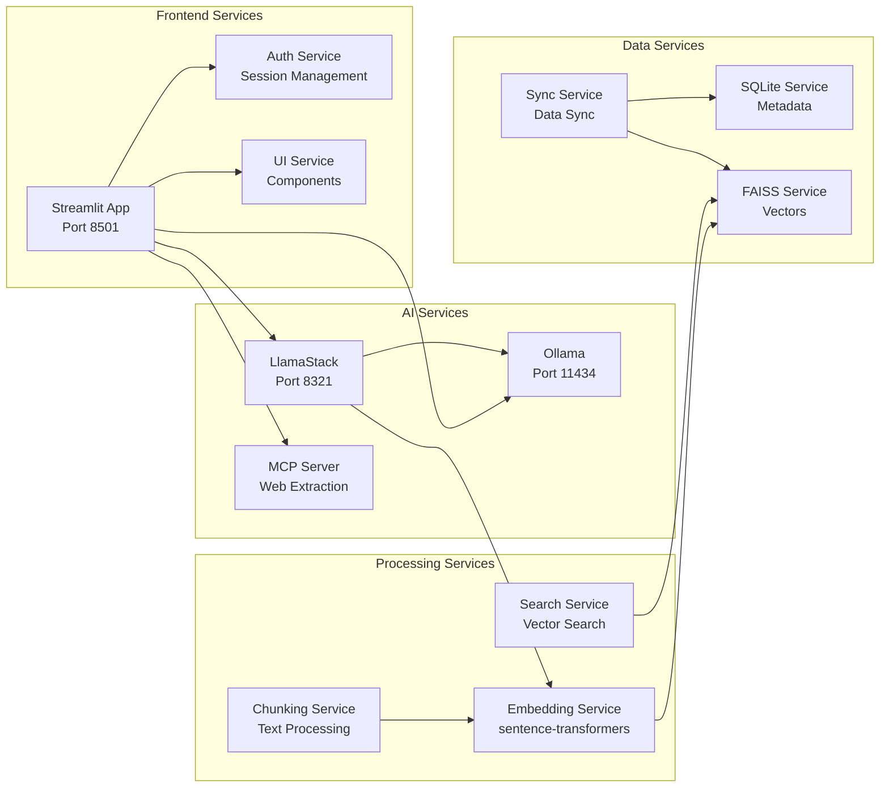

### **🔄 Component Interaction Flow**

#### **Document Processing Flow**

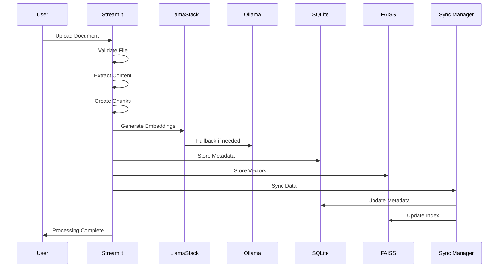

#### **Query Processing Flow**

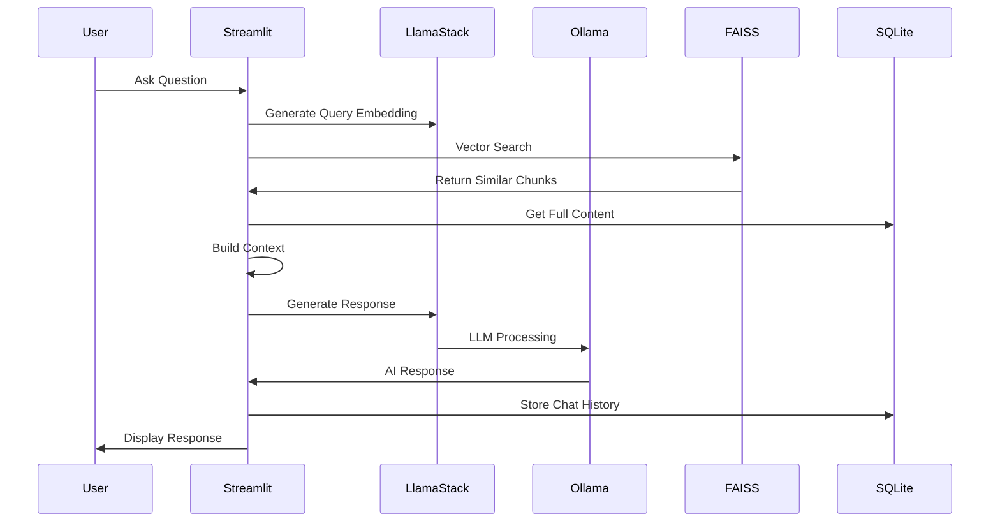

### **🔐 Security Architecture**

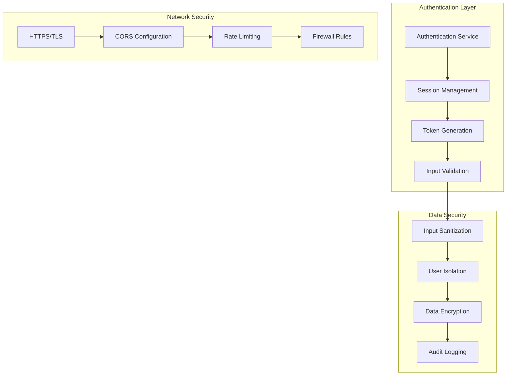

### **📊 Performance Architecture**

#### **Caching Strategy**

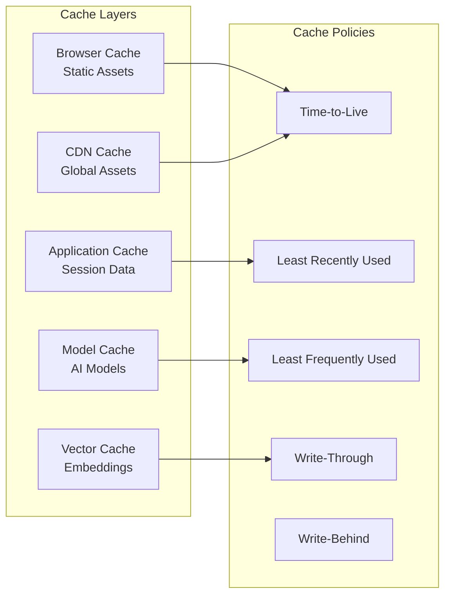

#### **Load Balancing & Scaling**

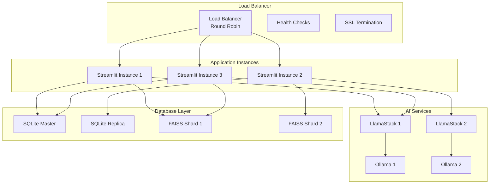

### **🔧 Deployment Architecture**

#### **Container Orchestration**

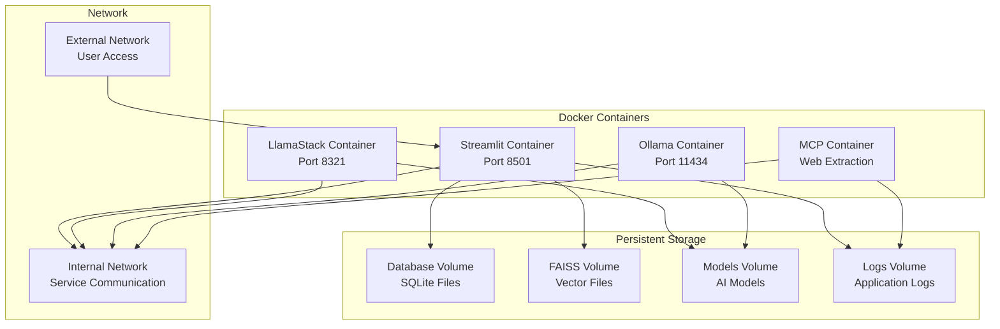

### **📈 Monitoring & Observability**

```mermaid
graph TB
    subgraph "Application Metrics"
        CPU[CPU Usage]
        MEMORY[Memory Usage]
        DISK[Disk Usage]
        NETWORK[Network I/O]
    end
    
    subgraph "Business Metrics"
        USERS[Active Users]
        DOCS[Documents Processed]
        QUERIES[Queries Handled]
        RESPONSE_TIME[Response Time]
    end
    
    subgraph "AI Metrics"
        EMBEDDING_TIME[Embedding Generation Time]
        SEARCH_TIME[Vector Search Time]
        LLM_TIME[LLM Response Time]
        ACCURACY[Response Accuracy]
    end
    
    subgraph "Infrastructure Metrics"
        SERVICE_HEALTH[Service Health]
        ERROR_RATE[Error Rate]
        THROUGHPUT[Throughput]
        LATENCY[Latency]
    end
    
    CPU --> SERVICE_HEALTH
    MEMORY --> SERVICE_HEALTH
    DISK --> SERVICE_HEALTH
    NETWORK --> SERVICE_HEALTH
    
    USERS --> THROUGHPUT
    DOCS --> THROUGHPUT
    QUERIES --> THROUGHPUT
    RESPONSE_TIME --> LATENCY
    
    EMBEDDING_TIME --> LATENCY
    SEARCH_TIME --> LATENCY
    LLM_TIME --> LATENCY
    ACCURACY --> ERROR_RATE
```

### **🔧 Configuration Management**

```yaml
# System Configuration Architecture
system:
  frontend:
    streamlit:
      port: 8501
      host: "0.0.0.0"
      max_upload_size: "50MB"
      theme: "dark"
  
  ai_services:
    llamastack:
      port: 8321
      host: "localhost"
      timeout: 30
      retry_attempts: 3
    
    ollama:
      port: 11434
      host: "localhost"
      default_model: "llama3.2:1b"
    
    embeddings:
      model: "all-MiniLM-L6-v2"
      dimension: 384
      batch_size: 32
  
  database:
    sqlite:
      path: "data/rag_llamastack.db"
      pool_size: 10
      timeout: 30
    
    faiss:
      index_type: "IndexFlatL2"
      dimension: 384
      storage_path: "data/faiss/"
  
  security:
    authentication:
      session_timeout: 3600
      token_expiry: 86400
      password_min_length: 8
    
    rate_limiting:
      requests_per_minute: 60
      burst_limit: 10
  
  performance:
    chunking:
      chunk_size: 3000
      overlap: 600
      max_chunks_per_file: 150
    
    search:
      similarity_threshold: 0.25
      max_results: 10
      reranking: true
```

---

## 🔐 **Security & User Management**

### **Authentication & Authorization**
- ✅ **User Registration & Login**
  - Secure user account creation
  - SHA256 password hashing
  - Session token generation
  - Role-based access control

- ✅ **Session Security**
  - Persistent login sessions with expiration
  - Secure session token management
  - Multi-user environment isolation
  - Session validation and cleanup

### **Data Security & Privacy**
- ✅ **Local Processing**
  - Privacy-focused local AI model support
  - Complete user data isolation
  - Secure file handling and validation
  - Input sanitization and validation

- ✅ **Error Handling**
  - Secure error messages without information disclosure
  - Comprehensive input validation
  - Safe document upload processing
  - Session security management

---

## 🌐 **Web Content & Integration**

### **Web Content Processing**
- ✅ **MCP Server Integration**
  - Advanced web content extraction
  - Mozilla Readability for clean parsing
  - Real-time web content embedding
  - URL validation and security

- ✅ **Fallback Extraction**
  - BeautifulSoup backup for compatibility
  - Domain and metadata extraction
  - Content quality validation
  - Processing error recovery

### **External Integrations**
- ✅ **API Specification**
  - OpenAPI-compliant REST API
  - Service orchestration (LlamaStack + Ollama + Streamlit)
  - Multiple AI model provider support
  - Webhook and event-driven processing

- ✅ **Model Registry**
  - Support for OpenAI, Anthropic, Fireworks, Groq
  - Model switching and fallback
  - Provider configuration management
  - Tool integration support

---

## 📊 **User Experience & Interface**

### **Modern Web Interface**
- ✅ **Streamlit Frontend**
  - Responsive web application interface
  - Dark/light theme support
  - Real-time updates and progress tracking
  - Interactive drag-and-drop components

- ✅ **User Experience Features**
  - Mobile-friendly responsive design
  - Accessibility support (screen readers, keyboard navigation)
  - Intuitive document and chat search
  - Organized document library interface

### **Interactive Features**
- ✅ **Progress Tracking**
  - Real-time upload and processing status
  - Performance metrics and statistics
  - Error recovery and graceful handling
  - Bulk operations support

- ✅ **Document Management**
  - Document library organization
  - Search interface and filtering
  - Document metadata display
  - Processing history tracking

---

## 🔧 **Development & Operations**

### **Development Tools**
- ✅ **Comprehensive Logging**
  - Detailed system and error logging
  - Debug tools and system diagnostics
  - Health monitoring and status checks
  - Performance analytics tracking

- ✅ **Error Tracking**
  - Comprehensive error handling
  - Error reporting and debugging
  - Development mode with debug information
  - Testing tools and utilities

### **Deployment & Operations**
- ✅ **Container Support**
  - Docker/Podman containerization
  - Service management with Makefile
  - Environment configuration flexibility
  - Automated health checks

- ✅ **Backup & Recovery**
  - Data persistence mechanisms
  - Recovery and restoration capabilities
  - Centralized logging and monitoring
  - Service orchestration management

---

## 📈 **Performance & Scalability**

### **Performance Optimization**
- ✅ **Batch Processing**
  - Efficient embedding generation
  - Memory management optimization
  - Database connection pooling
  - Parallel processing capabilities

- ✅ **Resource Management**
  - Optimized memory usage for large files
  - CPU and disk usage monitoring
  - Caching strategies for models and embeddings
  - Resource limit configuration

### **Scalability Features**
- ✅ **Multi-user Support**
  - Concurrent user handling
  - Service-based architecture
  - Horizontal scaling capabilities
  - Load balancing support

- ✅ **Capacity Planning**
  - Scalable storage and processing
  - Configurable resource constraints
  - Performance tuning parameters
  - Distributed processing support

---

## 🎨 **Advanced Features**

### **Analytics & Insights**
- ✅ **Processing Analytics**
  - Document processing statistics
  - User activity and system usage tracking
  - Performance monitoring and analytics
  - Quality metrics and relevance tracking

- ✅ **System Monitoring**
  - Comprehensive system health monitoring
  - Usage patterns and feature adoption
  - Performance benchmarking
  - Resource utilization tracking

### **Customization & Configuration**
- ✅ **Model Selection**
  - Configurable AI model choices
  - Adjustable processing parameters
  - User interface personalization
  - Search parameter configuration

- ✅ **Processing Options**
  - Configurable chunk sizes and overlap
  - Adjustable similarity thresholds
  - Customizable AI response parameters
  - Theme and interface customization

---

## 🔄 **Workflow & Process Management**

### **Document Workflow**
- ✅ **Upload Processing**
  - Multi-step document ingestion
  - Intelligent text extraction
  - Smart content segmentation
  - Vector representation creation

- ✅ **Quality Assurance**
  - Content and embedding validation
  - Efficient data storage and retrieval
  - Processing error handling
  - Quality control mechanisms

### **Query Processing Workflow**
- ✅ **Query Understanding**
  - Natural language query processing
  - Semantic similarity search
  - Relevant context assembly
  - AI-powered answer creation

- ✅ **Response Generation**
  - Document source citation
  - Response validation and improvement
  - Quality assurance checks
  - Context-aware responses

---

## 🎯 **Business & Use Case Support**

### **Enterprise Features**
- ✅ **Multi-user Environment**
  - Team collaboration support
  - Enterprise document organization
  - Corporate knowledge management
  - Research and analysis support

- ✅ **Knowledge Management**
  - Document content understanding
  - Efficient information discovery
  - Knowledge base creation
  - Content analysis capabilities

### **Research & Development**
- ✅ **RAG Research**
  - Advanced retrieval-augmented generation
  - Semantic search capabilities
  - Multiple AI model support
  - System optimization studies

- ✅ **Technology Integration**
  - Modern AI stack integration
  - Interface and workflow research
  - Performance optimization
  - Scalability research

---

## 📊 **Feature Status Summary**

| Category | Features | Status |
|----------|----------|---------|
| **Core RAG** | 12 features | ✅ Complete |
| **Architecture** | 8 features | ✅ Complete |
| **Security** | 8 features | ✅ Complete |
| **Web Integration** | 8 features | ✅ Complete |
| **User Experience** | 8 features | ✅ Complete |
| **Development** | 8 features | ✅ Complete |
| **Performance** | 8 features | ✅ Complete |
| **Advanced** | 8 features | ✅ Complete |
| **Workflow** | 8 features | ✅ Complete |
| **Business** | 8 features | ✅ Complete |

**Total: 84 Features** | **Status: ✅ Production Ready**

---

## 🚀 **Quick Start Checklist**

### **For Users**
- [ ] Upload documents (PDF, DOCX, PPTX, TXT, MD)
- [ ] Process web URLs for content extraction
- [ ] Ask questions about uploaded content
- [ ] View source citations and references
- [ ] Export chat history and documents
- [ ] Customize interface themes and settings

### **For Developers**
- [ ] Set up development environment
- [ ] Configure AI models and providers
- [ ] Deploy services (Ollama, LlamaStack, Streamlit)
- [ ] Configure database and storage
- [ ] Set up monitoring and logging
- [ ] Test all features and integrations

### **For Administrators**
- [ ] Configure user authentication
- [ ] Set up security and access controls
- [ ] Configure performance parameters
- [ ] Set up backup and recovery
- [ ] Monitor system health and performance
- [ ] Manage user accounts and sessions

---

## 📝 **Notes**

- **Last Updated**: January 2025
- **Version**: 1.0.0
- **Status**: Production Ready
- **Documentation**: Complete
- **Testing**: Comprehensive
- **Security**: Audited

---

*This document provides a comprehensive overview of all aspects and capabilities of the RAG LlamaStack application. For detailed technical information, refer to the individual component documentation and source code.* 