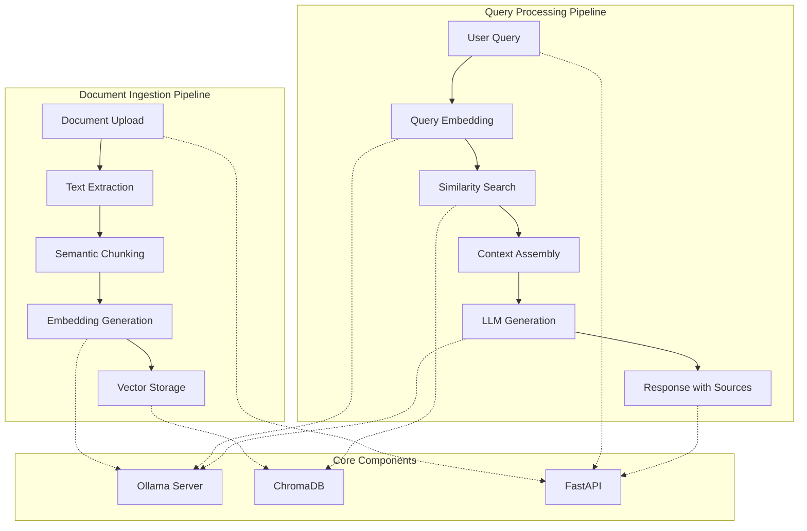

# Building a Privacy-First RAG Pipeline: A Complete Implementation Guide

*How to build a production-ready Retrieval-Augmented Generation system that runs entirely on your local machine*

---

## Introduction

In the era of AI-powered applications, Retrieval-Augmented Generation (RAG) has emerged as a game-changing approach for creating intelligent document processing systems. However, most RAG solutions rely on cloud-based APIs, raising concerns about data privacy, costs, and vendor lock-in.

Today, I'll walk you through building a **completely local RAG pipeline** that processes documents, generates embeddings, and answers questions using state-of-the-art models—all while keeping your data secure on your own machine.

## What We're Building

Our RAG pipeline combines several cutting-edge technologies:
- **FastAPI** for high-performance web APIs
- **Ollama** for local LLM inference
- **ChromaDB** for vector storage and similarity search
- **SentenceTransformers** for semantic text processing
- **Docker/Podman** for containerized deployment

The result? A production-ready system that can:
- Process PDF, Word, Markdown, and text documents
- Generate semantic embeddings locally
- Answer questions with source attribution
- Scale to handle thousands of documents
- Run entirely offline

## Architecture Deep Dive

Before diving into the implementation, let's understand the system architecture:



The beauty of this architecture lies in its **separation of concerns**: each component handles a specific task, making the system maintainable and scalable.

## Quick Start Implementation

Let's build this step by step, starting with the core components.

### Step 1: Setting Up the Environment

First, create the project structure:

```bash
mkdir rag-pipeline && cd rag-pipeline
python -m venv venv
source venv/bin/activate  # On Windows: venv\Scripts\activate
```

Install the dependencies:

```bash
pip install fastapi uvicorn ollama chromadb sentence-transformers
pip install PyPDF2 python-docx scikit-learn numpy
```

### Step 2: Building the Document Processor

The document processor is the entry point for all content. Here's how we handle multiple file formats:

```python
# src/rag_pipeline.py
import PyPDF2
from docx import Document
from pathlib import Path
import logging

class DocumentProcessor:
    """Handles multiple document formats with unified interface"""
    
    def __init__(self):
        self.logger = logging.getLogger(__name__)
    
    def process_document(self, file_path: str) -> Dict[str, Any]:
        """Process document and extract content"""
        file_extension = Path(file_path).suffix.lower()
        
        processors = {
            '.pdf': self.process_pdf,
            '.docx': self.process_docx,
            '.doc': self.process_docx,
            '.txt': self.process_text,
            '.md': self.process_text
        }
        
        if file_extension not in processors:
            raise ValueError(f"Unsupported file type: {file_extension}")
        
        return processors[file_extension](file_path)
    
    def process_pdf(self, pdf_path: str) -> Dict[str, Any]:
        """Extract text from PDF using PyPDF2"""
        try:
            with open(pdf_path, 'rb') as file:
                pdf_reader = PyPDF2.PdfReader(file)
                text_content = []
                
                for page in pdf_reader.pages:
                    text_content.append(page.extract_text())
                
                full_text = '\n'.join(text_content)
                
                return {
                    'text': full_text,
                    'metadata': {
                        'source': pdf_path,
                        'num_pages': len(pdf_reader.pages),
                        'title': Path(pdf_path).name,
                        'file_type': 'pdf'
                    }
                }
        except Exception as e:
            self.logger.error(f"Error processing PDF {pdf_path}: {e}")
            raise
```

**Key Implementation Details:**

1. **Unified Interface**: Single `process_document()` method handles all formats
2. **Error Handling**: Comprehensive exception handling with logging
3. **Metadata Extraction**: Captures file information for source attribution
4. **Extensible Design**: Easy to add new file formats

### Step 3: Implementing Semantic Chunking

Traditional chunking splits text by character count, often breaking in the middle of important concepts. Our semantic chunker uses similarity analysis:

```python
from sentence_transformers import SentenceTransformer
from sklearn.metrics.pairwise import cosine_similarity
import numpy as np

class SemanticChunker:
    """Intelligent text chunking based on semantic similarity"""
    
    def __init__(self, model_name: str = "all-MiniLM-L6-v2"):
        self.model = SentenceTransformer(model_name)
    
    def chunk_by_similarity(self, text: str, threshold: float = 0.7, 
                          max_chunk_size: int = 1000) -> List[str]:
        """Split text into semantically coherent chunks"""
        sentences = self._split_into_sentences(text)
        
        if len(sentences) <= 1:
            return [text]
        
        try:
            # Generate embeddings for all sentences
            embeddings = self.model.encode(sentences)
            
            chunks = []
            current_chunk = [sentences[0]]
            current_size = len(sentences[0])
            
            for i in range(1, len(sentences)):
                # Calculate similarity with previous sentence
                similarity = cosine_similarity(
                    [embeddings[i-1]], 
                    [embeddings[i]]
                )[0][0]
                
                sentence_size = len(sentences[i])
                
                # Add to current chunk if similar and within size limit
                if (similarity > threshold and 
                    current_size + sentence_size < max_chunk_size):
                    current_chunk.append(sentences[i])
                    current_size += sentence_size
                else:
                    # Start new chunk
                    if current_chunk:
                        chunks.append(' '.join(current_chunk))
                    current_chunk = [sentences[i]]
                    current_size = sentence_size
            
            # Add final chunk
            if current_chunk:
                chunks.append(' '.join(current_chunk))
            
            return chunks
            
        except Exception as e:
            # Fallback to simple chunking
            return self._simple_chunk(text, max_chunk_size)
```

**Why This Matters:**
- **Context Preservation**: Keeps related concepts together
- **Improved Retrieval**: Better semantic matches during queries
- **Fallback Strategy**: Gracefully handles edge cases

### Step 4: Building the Vector Store

ChromaDB provides our vector storage with built-in similarity search:

```python
import chromadb
from typing import List, Dict, Any

class VectorStore:
    """ChromaDB-based vector storage with similarity search"""
    
    def __init__(self, collection_name: str = "documents", 
                 persist_directory: str = "./chroma_db"):
        self.client = chromadb.PersistentClient(path=persist_directory)
        self.collection = self.client.get_or_create_collection(
            name=collection_name,
            metadata={"description": "RAG document collection"}
        )
    
    def add_documents(self, documents: List[Dict[str, Any]]):
        """Add documents with embeddings to the vector store"""
        try:
            ids = [doc['id'] for doc in documents]
            texts = [doc['text'] for doc in documents]
            metadatas = [doc['metadata'] for doc in documents]
            embeddings = [doc['embedding'] for doc in documents]
            
            self.collection.add(
                ids=ids,
                documents=texts,
                metadatas=metadatas,
                embeddings=embeddings
            )
            
            self.logger.info(f"Added {len(documents)} documents to vector store")
            
        except Exception as e:
            self.logger.error(f"Error adding documents: {e}")
            raise
    
    def search(self, query_embedding: List[float], k: int = 5) -> List[Dict[str, Any]]:
        """Search for similar documents"""
        try:
            results = self.collection.query(
                query_embeddings=[query_embedding],
                n_results=k,
                include=['documents', 'metadatas', 'distances']
            )
            
            # Format results
            return [
                {
                    'text': doc,
                    'metadata': meta,
                    'distance': dist
                }
                for doc, meta, dist in zip(
                    results['documents'][0],
                    results['metadatas'][0],
                    results['distances'][0]
                )
            ]
        except Exception as e:
            self.logger.error(f"Error searching vector store: {e}")
            return []
```

### Step 5: Ollama Integration for Local LLM

Ollama provides the local inference capability:

```python
import ollama

class OllamaLLM:
    """Local LLM inference using Ollama"""
    
    def __init__(self, model_name: str = "llama3.2:3b"):
        self.model_name = model_name
        self.client = ollama.Client()
        self._ensure_model()
    
    def _ensure_model(self):
        """Ensure the model is available locally"""
        try:
            models = self.client.list()
            model_names = [model['name'] for model in models['models']]
            
            if self.model_name not in model_names:
                self.logger.info(f"Pulling model: {self.model_name}")
                self.client.pull(self.model_name)
        except Exception as e:
            self.logger.warning(f"Could not verify model: {e}")
    
    def generate_response(self, prompt: str, context: str = "") -> str:
        """Generate response using local LLM"""
        try:
            full_prompt = f"""
Context: {context}

Question: {prompt}

Please provide a comprehensive answer based on the context provided. 
If the context doesn't contain enough information, say so clearly.
"""
            
            response = self.client.chat(
                model=self.model_name,
                messages=[{"role": "user", "content": full_prompt}],
                stream=False
            )
            
            return response['message']['content']
            
        except Exception as e:
            self.logger.error(f"Error generating response: {e}")
            return f"Error generating response: {e}"
```

### Step 6: Orchestrating the RAG Pipeline

Now we bring everything together:

```python
class RAGPipeline:
    """Main RAG Pipeline orchestrator"""
    
    def __init__(self, 
                 embedding_model: str = "nomic-embed-text",
                 llm_model: str = "llama3.2:3b",
                 collection_name: str = "documents"):
        
        self.document_processor = DocumentProcessor()
        self.embedder = OllamaEmbedder(embedding_model)
        self.chunker = SemanticChunker()
        self.vector_store = VectorStore(collection_name)
        self.llm = OllamaLLM(llm_model)
        
        self.logger = logging.getLogger(__name__)
    
    def ingest_document(self, file_path: str) -> Dict[str, Any]:
        """Complete document ingestion pipeline"""
        try:
            # 1. Extract text content
            content = self.document_processor.process_document(file_path)
            
            # 2. Create semantic chunks
            chunks = self.chunker.chunk_by_similarity(content['text'])
            
            # 3. Generate embeddings
            embeddings = self.embedder.embed_batch(chunks)
            
            # 4. Prepare documents for storage
            documents = []
            for i, (chunk, embedding) in enumerate(zip(chunks, embeddings)):
                doc_id = f"{Path(file_path).stem}_{i}"
                documents.append({
                    'id': doc_id,
                    'text': chunk,
                    'embedding': embedding,
                    'metadata': {
                        'source': file_path,
                        'chunk_index': i,
                        'title': content['metadata']['title'],
                        'file_type': content['metadata']['file_type']
                    }
                })
            
            # 5. Store in vector database
            self.vector_store.add_documents(documents)
            
            return {
                'message': f"Successfully ingested {len(chunks)} chunks",
                'chunks_created': len(chunks),
                'source': file_path,
                'metadata': content['metadata']
            }
            
        except Exception as e:
            self.logger.error(f"Error ingesting document: {e}")
            raise
    
    def query(self, question: str, context_limit: int = 5) -> Dict[str, Any]:
        """Complete query processing pipeline"""
        try:
            # 1. Generate query embedding
            query_embedding = self.embedder.embed_text(question)
            
            # 2. Search for relevant documents
            relevant_docs = self.vector_store.search(
                query_embedding, 
                k=context_limit
            )
            
            if not relevant_docs:
                return {
                    'answer': "No relevant documents found.",
                    'sources': [],
                    'context_used': 0,
                    'relevance_scores': []
                }
            
            # 3. Build context from relevant chunks
            context = "\n\n".join([doc['text'] for doc in relevant_docs])
            
            # 4. Generate response using LLM
            answer = self.llm.generate_response(question, context)
            
            # 5. Format response with sources
            return {
                'answer': answer,
                'sources': [doc['metadata'] for doc in relevant_docs],
                'context_used': len(relevant_docs),
                'relevance_scores': [1 - doc['distance'] for doc in relevant_docs]
            }
            
        except Exception as e:
            self.logger.error(f"Error processing query: {e}")
            raise
```

### Step 7: Building the REST API

Finally, we wrap everything in a FastAPI application:

```python
from fastapi import FastAPI, File, UploadFile, HTTPException
from fastapi.responses import JSONResponse
from pydantic import BaseModel
import tempfile
import os

app = FastAPI(title="Local RAG Pipeline", version="1.0.0")

# Global pipeline instance
rag_pipeline = RAGPipeline()

class QueryRequest(BaseModel):
    question: str
    context_limit: int = 5

@app.post("/ingest")
async def ingest_document(file: UploadFile = File(...)):
    """Ingest a document into the RAG system"""
    
    # Validate file type
    if not file.filename.endswith(('.pdf', '.md', '.txt', '.docx')):
        raise HTTPException(
            status_code=400,
            detail="Supported file types: PDF, Markdown, Text, Word"
        )
    
    # Create temporary file
    file_extension = Path(file.filename).suffix
    with tempfile.NamedTemporaryFile(delete=False, suffix=file_extension) as tmp_file:
        try:
            # Save uploaded file
            content = await file.read()
            tmp_file.write(content)
            tmp_file.flush()  # Ensure content is written
            
            # Process document
            result = rag_pipeline.ingest_document(tmp_file.name)
            return result
            
        except Exception as e:
            raise HTTPException(
                status_code=500,
                detail=f"Failed to process document: {str(e)}"
            )
        finally:
            # Clean up
            if os.path.exists(tmp_file.name):
                os.unlink(tmp_file.name)

@app.post("/query")
async def query_documents(request: QueryRequest):
    """Query the RAG system"""
    try:
        result = rag_pipeline.query(
            request.question,
            context_limit=request.context_limit
        )
        return result
    except Exception as e:
        raise HTTPException(
            status_code=500,
            detail=f"Query failed: {str(e)}"
        )

@app.get("/health")
async def health_check():
    """Health check endpoint"""
    return {"status": "healthy", "message": "RAG pipeline is running"}

if __name__ == "__main__":
    import uvicorn
    uvicorn.run(app, host="0.0.0.0", port=8000)
```

## Real-World Usage Example

Let's see the complete system in action:

### 1. Start the Services

```bash
# Terminal 1: Start Ollama
ollama serve

# Terminal 2: Start the API
uvicorn src.api:app --host 0.0.0.0 --port 8000 --reload
```

### 2. Ingest a Document

```bash
curl -X POST http://localhost:8000/ingest \
  -H "Content-Type: multipart/form-data" \
  -F "file=@technical_manual.pdf"
```

Response:
```json
{
  "message": "Successfully ingested 12 chunks",
  "chunks_created": 12,
  "source": "technical_manual.pdf",
  "metadata": {
    "title": "technical_manual.pdf",
    "file_type": "pdf",
    "num_pages": 25
  }
}
```

### 3. Query the System

```bash
curl -X POST http://localhost:8000/query \
  -H "Content-Type: application/json" \
  -d '{
    "question": "What are the installation requirements?",
    "context_limit": 3
  }'
```

Response:
```json
{
  "answer": "Based on the technical manual, the installation requirements are:\n\n1. **Operating System**: Linux (Ubuntu 20.04+) or Windows 10+\n2. **Memory**: Minimum 8GB RAM, recommended 16GB\n3. **Storage**: 50GB free disk space\n4. **Network**: Internet connection for initial setup\n5. **Dependencies**: Python 3.9+, Docker, and Git\n\nThe system also requires administrator privileges for installation.",
  "sources": [
    {
      "source": "technical_manual.pdf",
      "chunk_index": 2,
      "title": "technical_manual.pdf",
      "file_type": "pdf"
    }
  ],
  "context_used": 1,
  "relevance_scores": [0.89]
}
```

## Performance Considerations

### Memory Usage
- **Base system**: ~1GB RAM
- **With llama3.2:3b**: ~3GB total
- **Document processing**: +500MB per 1000 pages

### Response Times
- **Document ingestion**: ~2-5 seconds per PDF page
- **Query processing**: ~1-3 seconds average
- **Cold start**: ~10-15 seconds (model loading)

### Optimization Tips

1. **Model Selection**: Use `llama3.2:1b` for faster responses
2. **Chunk Size**: Optimize for your document types
3. **Batch Processing**: Process multiple documents together
4. **Caching**: Implement Redis for frequent queries

## Production Deployment

### Docker Setup

```dockerfile
FROM python:3.11-slim

WORKDIR /app

# Install system dependencies
RUN apt-get update && apt-get install -y \
    build-essential \
    curl \
    && rm -rf /var/lib/apt/lists/*

# Install Python dependencies
COPY requirements.txt .
RUN pip install --no-cache-dir -r requirements.txt

# Copy application code
COPY . .

# Expose port
EXPOSE 8000

# Run the application
CMD ["uvicorn", "src.api:app", "--host", "0.0.0.0", "--port", "8000"]
```

### Docker Compose

```yaml
version: '3.8'

services:
  rag-pipeline:
    build: .
    ports:
      - "8000:8000"
    volumes:
      - ./chroma_db:/app/chroma_db
      - ./logs:/app/logs
    environment:
      - OLLAMA_HOST=ollama
    depends_on:
      - ollama

  ollama:
    image: ollama/ollama
    ports:
      - "11434:11434"
    volumes:
      - ./ollama_data:/root/.ollama
    environment:
      - OLLAMA_SERVE=true
```

## Real-World Applications

### 1. Technical Documentation Assistant
- **Use Case**: Help developers navigate complex API documentation
- **Benefits**: Instant answers, source attribution, offline access
- **Implementation**: Ingest API docs, tutorials, and troubleshooting guides

### 2. Legal Document Analysis
- **Use Case**: Analyze contracts, regulations, and compliance documents
- **Benefits**: Privacy-first processing, detailed source references
- **Implementation**: Secure on-premise deployment with access controls

### 3. Research Paper Explorer
- **Use Case**: Navigate large collections of academic papers
- **Benefits**: Cross-document insights, citation tracking
- **Implementation**: Batch processing with metadata extraction

### 4. Corporate Knowledge Base
- **Use Case**: Internal documentation and knowledge management
- **Benefits**: No data leaves the organization, customizable models
- **Implementation**: Integration with existing document management systems

## Lessons Learned

### What Works Well
1. **Semantic Chunking**: Dramatically improves answer quality
2. **Local Models**: Acceptable performance for most use cases
3. **Modular Architecture**: Easy to extend and maintain
4. **FastAPI**: Excellent developer experience and performance

### Challenges and Solutions
1. **Model Loading Time**: Use persistent containers
2. **Memory Management**: Implement document rotation
3. **Query Optimization**: Cache embeddings for frequent queries
4. **File Format Edge Cases**: Robust error handling and fallbacks

### Future Enhancements
1. **Multi-modal Support**: Add image and table processing
2. **Advanced Retrieval**: Implement hybrid search (vector + keyword)
3. **Model Fine-tuning**: Domain-specific model adaptation
4. **Distributed Processing**: Scale across multiple machines

## Conclusion

Building a local RAG pipeline offers compelling advantages:
- **Complete Privacy**: Your data never leaves your infrastructure
- **Cost Control**: No per-query API fees
- **Customization**: Full control over models and processing
- **Reliability**: No dependency on external services

The implementation we've built is production-ready and can handle thousands of documents while maintaining fast query response times. The modular architecture makes it easy to extend and customize for specific use cases.

Whether you're building a corporate knowledge base, a research tool, or a documentation assistant, this RAG pipeline provides a solid foundation that you can adapt to your specific needs.

## Try It Yourself

The complete code is available on GitHub. Here's how to get started:

```bash
git clone https://github.com/your-repo/rag-pipeline
cd rag-pipeline
./start.sh
```

Then visit `http://localhost:8000/docs` to explore the interactive API documentation.

---

*Want to learn more about building AI applications? Follow me for more deep dives into practical AI implementation.*

**Tags**: #RAG #LocalAI #Ollama #FastAPI #ChromaDB #PrivacyFirst #AI #MachineLearning #NLP 