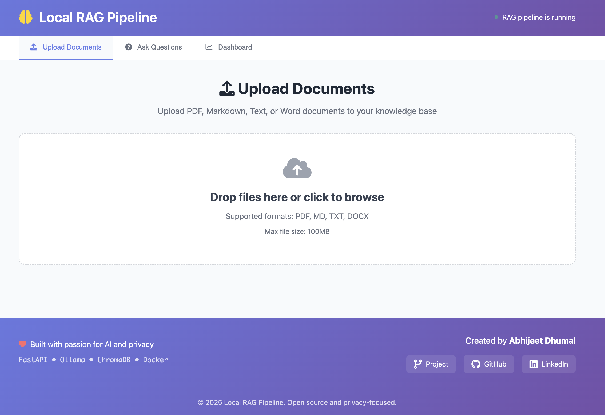
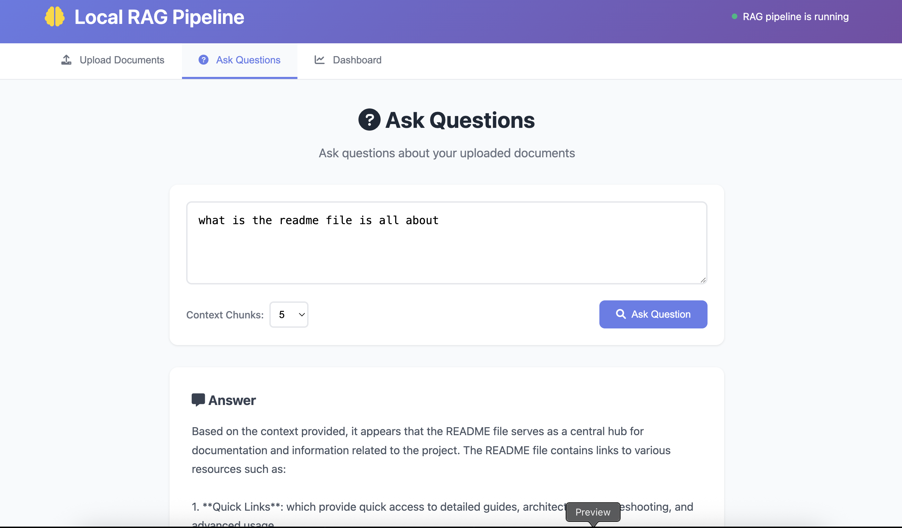
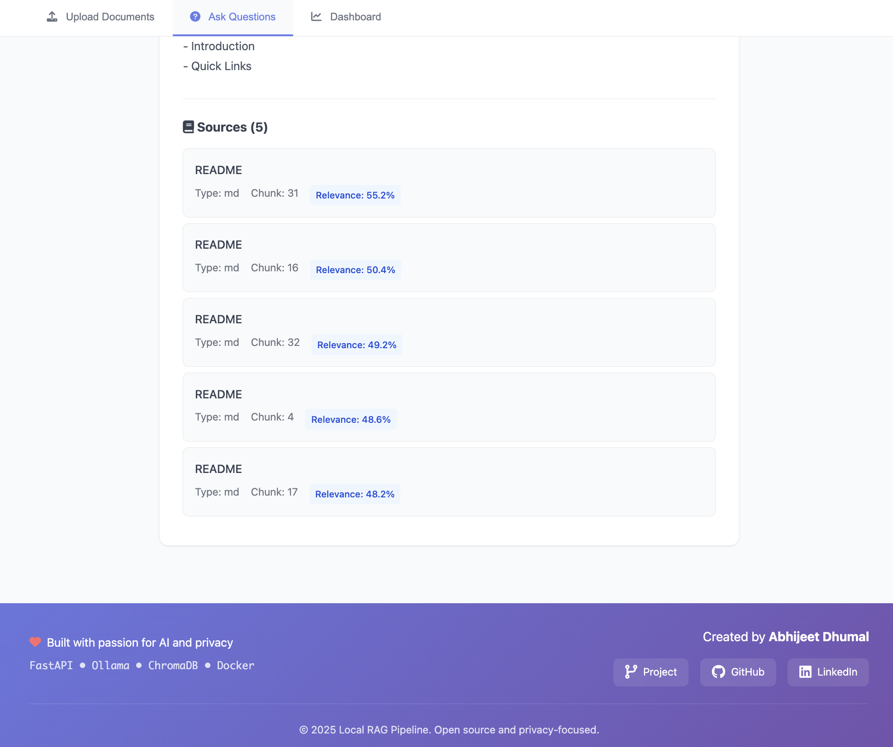
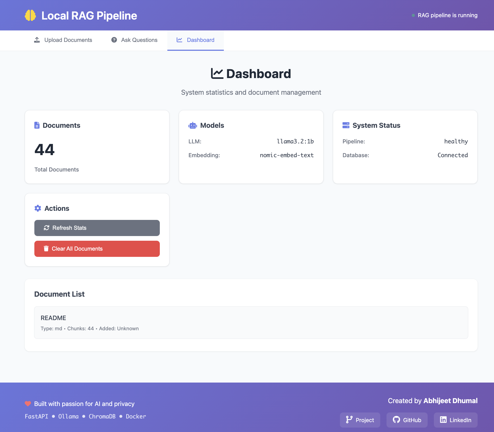

# 🚀 Local RAG Pipeline with Ollama

[](https://opensource.org/licenses/MIT)
[](https://www.python.org/downloads/)
[](https://fastapi.tiangolo.com/)
[](https://ollama.com/)
[](https://github.com/YOUR_USERNAME/rag-project/actions/workflows/ci.yml)
[](https://github.com/psf/black)

A **privacy-focused** Retrieval-Augmented Generation (RAG) pipeline that runs entirely on your local machine. Built with FastAPI, Ollama, and ChromaDB for secure document processing and intelligent question answering.

## 🏗️ End-to-End User Flow

```
┌─────────────────────────────────────────────────────────────────────────────────┐
│                        🌐 Web Interface (localhost:8000)                        │
├─────────────────────┬─────────────────────┬─────────────────────────────────────┤
│   📤 Upload Tab     │   🔍 Query Tab      │        📊 Dashboard Tab             │
│  Drag & Drop Files  │  Ask Questions      │      Monitor System                 │
└──────────┬──────────┴──────────┬──────────┴──────────┬──────────────────────────┘
           │                     │                     │
           │                     │                     │
           ▼                     ▼                     ▼
┌─────────────────────────────────────────────────────────────────────────────────┐
│                    📄 Document Processing Pipeline                              │
├─────────────────────────────────────────────────────────────────────────────────┤
│                                                                                 │
│  Upload File ──▶ Validate ──▶ Extract Text ──▶ Create Chunks ──▶ Store Vector   │
│  (PDF/MD/TXT/   (Format     (Parse Content)   (Semantic Split)  (ChromaDB +     │
│   DOCX)          Check)                        (~1000 chars)     Metadata)      │
│                                                                                 │
└─────────────────────────────────────────────────────────────────────────────────┘

┌─────────────────────────────────────────────────────────────────────────────────┐
│                         ❓ Question Answering Flow                              │
├─────────────────────────────────────────────────────────────────────────────────┤
│                                                                                 │
│  User Question ──▶ Embed Query ──▶ Search Database ──▶ Build Context ──▶ Answer │
│  (Natural         (Vector        (Find Similar     (Combine Best    (LLM with   │
│   Language)        Embedding)     Chunks)          Chunks)          Citations)  │
│                                                                                 │
└─────────────────────────────────────────────────────────────────────────────────┘

┌─────────────────────────────────────────────────────────────────────────────────┐
│                            🖥️ Core Services                                     │
├─────────────────────────────────────────────────────────────────────────────────┤
│                                                                                 │
│  ┌─────────────────┐    ┌─────────────────┐    ┌─────────────────┐              │
│  │   FastAPI       │    │     Ollama      │    │    ChromaDB     │              │
│  │   Server        │    │     Server      │    │    Vector       │              │
│  │ 🚀 Port 8000    │    │ 🤖 Port 11434   │    │    Database     │              │
│  │ 📚 REST API     │    │ 🔥 Local LLM    │    │ 💾 Persistent   │              │
│  │                 │    │                 │    │    Storage      │              │
│  └─────────────────┘    └─────────────────┘    └─────────────────┘              │
│                                                                                 │
│  • Serves Web UI        • Embeddings       • Vector Storage                     │
│  • Handles API calls    • Text Generation  • Similarity Search                  │
│  • Manages uploads      • Model: llama3.2:1b  • Metadata Storage                │
│                         • Model: nomic-embed                                    │
└─────────────────────────────────────────────────────────────────────────────────┘

                                    📡 Data Flow
                          ┌─────────────────────────────┐
                          │ User  ◀──────────────▶ API  │
                          │ API   ◀──────────────▶ LLM  │
                          │ API   ◀──────────────▶ DB   │
                          └─────────────────────────────┘
```

## ✨ Features

- 🔒 **100% Local Processing** - No data leaves your machine
- 🌐 **Modern Web UI** - Responsive interface with drag & drop uploads
- 📄 **Multi-format Support** - PDF, Markdown, Text, and Word documents
- 🧠 **Semantic Chunking** - Intelligent document segmentation
- 🔍 **Vector Search** - Fast similarity-based retrieval
- 🤖 **Local LLM** - Powered by Ollama (llama3.2:1b)
- 🚀 **Fast API** - RESTful interface with auto-generated docs
- 📊 **Persistent Storage** - ChromaDB vector database
- 🐳 **Docker Ready** - Complete containerization

## 🏗️ System Architecture

```
Web Interface (Port 8000)
         ↓
┌─────────────────────────────────────────────────────────────┐
│                  📄 Document Processing                     │
│                                                             │
│  Upload → Validate → Extract → Chunk → Embed → Store        │
│  (Files)  (Format)   (Text)   (Split) (Vector) (ChromaDB)   │
└─────────────────────────────────────────────────────────────┘
         ↓
┌─────────────────────────────────────────────────────────────┐
│                   🔍 Query Processing                       │
│                                                             │
│  Question → Embed → Search → Context → Generate → Response  │
│  (User)     (Vector) (DB)    (Build)   (LLM)     (Answer)   │
└─────────────────────────────────────────────────────────────┘
         ↓
┌─────────────────────────────────────────────────────────────┐
│                    🖥️ Core Services                         │
│                                                             │
│  FastAPI Server  ←→  Ollama Service  ←→  ChromaDB           │
│  (Port 8000)         (Port 11434)       (Vector Store)      │
│  • Web UI            • Text Generation  • Embeddings        │
│  • REST API          • Embeddings       • Similarity        │
│  • File Upload       • llama3.2:1b      • Metadata          │
│                      • nomic-embed-text                     │
└─────────────────────────────────────────────────────────────┘
```

## 📁 Directory Structure

```
rag-project/
├── src/                          # Core application code
│   ├── api.py
│   ├── rag_pipeline.py
│   └── __init__.py
├── static/                       # Web interface files
│   ├── index.html
│   ├── script.js
│   └── style.css
├── config/                       # Configuration files
│   └── settings.py
├── tests/                        # Test files
│   └── test_rag_pipeline.py
├── sample_docs/                  # Example documents
│   └── ui_screenshots/
├── deploy/                       # Deployment configurations
│   ├── Dockerfile
│   ├── docker-compose.yml
│   ├── docker-compose.override.yml
│   ├── nginx.conf
│   ├── k8s-deployment.yaml
│   └── run.sh
├── scripts/                      # Utility scripts
│   ├── init-models.sh
│   └── start.sh
├── chroma_db/                    # Vector database storage
├── requirements.txt
├── requirements-dev.txt
├── README.md
├── CONTRIBUTING.md
├── LICENSE
└── .gitignore
```

**Key Directories:**
- **`src/`** - Main application code (FastAPI + RAG logic)
- **`static/`** - Web UI files (HTML, CSS, JS)
- **`chroma_db/`** - Persistent vector database storage
- **`ollama_data/`** - Downloaded AI models storage
- **`sample_docs/`** - Example files and screenshots

**Configuration Files:**
- **`requirements*.txt`** - Python dependencies
- **`docker-compose*.yml`** - Container orchestration
- **`Dockerfile`** - Container build recipe
- **`start.sh`** - Local development launcher

## 🚀 How to Run This Project

### 1. **Container Compose (Recommended)**
```bash
# Option A: Use the convenience script (auto-detects Docker/Podman)
cd deploy && ./run.sh

# Option B: Manual commands

# With Podman
cd deploy
podman-compose up -d
# OR with docker-compose + podman backend
DOCKER_HOST=unix:///run/user/$UID/podman/podman.sock docker-compose up -d

# With Docker
cd deploy
docker-compose up -d

# Build and start
podman-compose up --build -d  # or docker-compose up --build -d

# Access: http://localhost:8000
```

### 2. **Local Development Setup**
```bash
# Install dependencies
pip install -r requirements.txt

# Start Ollama
ollama serve

# Pull models
ollama pull nomic-embed-text
ollama pull llama3.2:1b

# Run FastAPI
uvicorn src.api:app --reload --host 0.0.0.0 --port 8000
```

### 3. **Development Mode with Hot Reload**
```bash
# Uses docker-compose.override.yml for development
cd deploy

# With Podman
podman-compose -f docker-compose.yml -f docker-compose.override.yml up

# With Docker
docker-compose -f docker-compose.yml -f docker-compose.override.yml up
```

### 4. **Production Deployment**
```bash
# With nginx reverse proxy
cd deploy
docker-compose --profile production up -d

# With caching enabled
docker-compose --profile production --profile cache up -d
```

### 5. **GPU-Enabled Setup**
```bash
# Uncomment GPU section in docker-compose.yml first
cd deploy
docker-compose up -d
```

### 6. **Individual Container Approach**
```bash
# Start Ollama
docker run -d -p 11434:11434 -v ./ollama_data:/root/.ollama ollama/ollama

# Pull models
docker exec -it <ollama-container> ollama pull nomic-embed-text
docker exec -it <ollama-container> ollama pull llama3.2:1b

# Build and run your app
docker build -t rag-pipeline -f deploy/Dockerfile .
docker run -d -p 8000:8000 -v ./chroma_db:/app/chroma_db rag-pipeline
```

### 7. **Start Script (Local)**
```bash
# Make executable and run
chmod +x scripts/start.sh
./scripts/start.sh
```

## 📋 Prerequisites

- **Container Engine**: Docker + Docker Compose OR Podman + podman-compose
- **Python 3.11+** (for local development)
- **Ollama** (for local development)
- **At least 4GB RAM** (8GB recommended)

### Container Engine Setup

**Podman (Recommended for rootless containers):**
```bash
# macOS
brew install podman podman-compose

# Linux (RHEL/CentOS/Fedora)
sudo dnf install podman podman-compose

# Linux (Ubuntu/Debian)
sudo apt install podman podman-compose
```

**Docker:**
```bash
# Install Docker Desktop from docker.com
# Or on Linux: sudo apt install docker.io docker-compose
```

## 🔧 API Endpoints

| Method | Endpoint | Description |
|--------|----------|-------------|
| `GET` | `/` | Web UI interface |
| `GET` | `/health` | Health check |
| `GET` | `/docs` | Interactive API documentation |
| `POST` | `/upload` | Upload and process a document |
| `POST` | `/query` | Ask questions about documents |
| `GET` | `/stats` | Get pipeline statistics |
| `DELETE` | `/documents` | Clear all documents |

## 🌐 Web Interface

Access the modern web interface at `http://localhost:8000` with:

- **📤 Upload Documents** - Drag & drop interface for PDF, MD, TXT, DOCX files
- **🔍 Query Interface** - Natural language queries with context-aware responses
- **📊 Dashboard** - System monitoring and document management
- **📱 Mobile Support** - Responsive design for all devices
- **⌨️ Keyboard Shortcuts** - Ctrl+U (upload), Ctrl+K (query), Ctrl+Enter (submit)

## 🛠️ Usage Examples

### Upload a document
```bash
curl -X POST "http://localhost:8000/upload" \
  -F "file=@document.pdf"
```

### Query with RAG
```bash
curl -X POST "http://localhost:8000/query" \
  -H "Content-Type: application/json" \
  -d '{"query": "What is the main topic?"}'
```

## 🔍 Troubleshooting

### Common Issues

1. **Model Download Fails**: Check internet connection and disk space
2. **Out of Memory**: Already using optimized model (`llama3.2:1b`) or increase Docker memory limits
3. **Port Conflicts**: Change ports in docker-compose.yml
4. **Permission Issues**: Check file permissions with `chmod -R 755 chroma_db/`

### Debug Commands
```bash
# Navigate to deploy directory first
cd deploy

# Check service health
podman-compose ps        # or docker-compose ps

# View logs
podman-compose logs -f rag-pipeline   # or docker-compose logs -f rag-pipeline

# Check models
podman-compose exec ollama ollama list   # or docker-compose exec ollama ollama list

# Check running containers
podman ps               # or docker ps
```

## 🤝 Contributing

1. Fork the repository
2. Create a feature branch
3. Make your changes
4. Add tests
5. Submit a pull request

## 📄 License

This project is licensed under the MIT License - see the LICENSE file for details.

## Web Interface Screenshots

### Document Upload Interface

*Drag & drop document upload with real-time processing feedback*

### Query Interface


*Clean query interface with context-aware responses and source citations*

### Dashboard Interface

*System monitoring dashboard with real-time metrics and document management* 