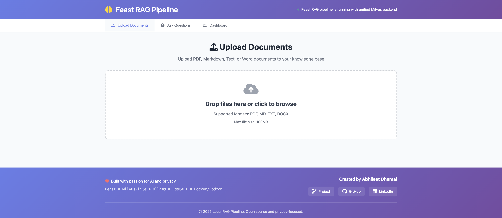
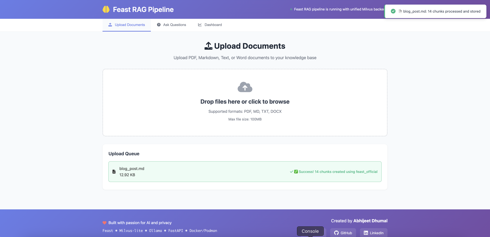
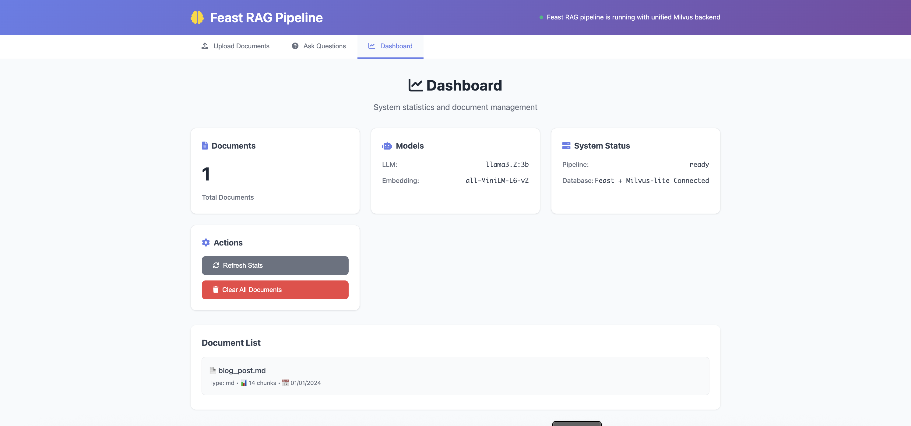
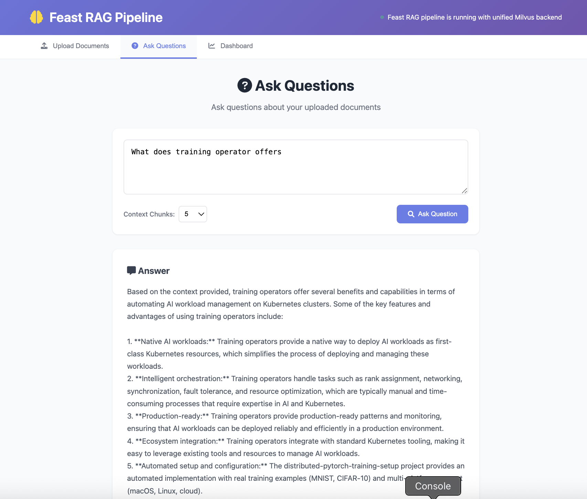
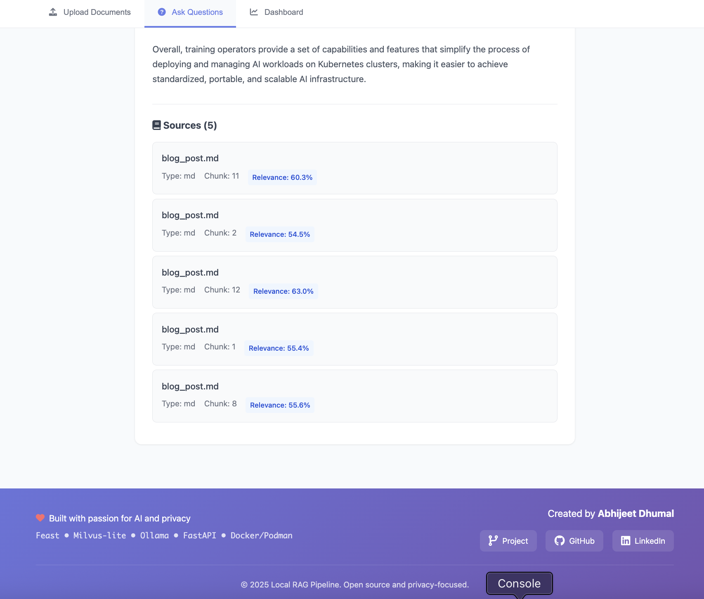

# 🚀 Advanced RAG Pipeline with Feast Feature Store + Milvus Vector DB

[](https://opensource.org/licenses/MIT)
[](https://www.python.org/downloads/)
[](https://fastapi.tiangolo.com/)
[](https://ollama.com/)
[](https://feast.dev/)
[](https://milvus.io/)

A **production-ready** Retrieval-Augmented Generation (RAG) pipeline with advanced feature store capabilities. Built with **Feast feature store**, **Milvus-lite vector database**, and **Ollama LLM** for document processing and intelligent question answering.

## 📸 Web Interface

### Main Dashboard

*Main dashboard showing query results with context-aware responses, source citations, and relevance scoring*

### Document Processing Pipeline

*Document processing workflow showing upload progress, chunking process, and embedding generation*

### System Dashboard Statistics & Monitoring

*System statistics dashboard displaying real-time metrics, document counts, and performance indicators*

### QnA

*Question and Answer interface with query input, response display, and document source references*

### Query Interface

*Primary query interface with smart question processing and real-time response generation*

## 🏗️ System Architecture

```
                    🌐 Web Interface (localhost:8000)
                                    │
                    ┌───────────────▼───────────────┐
                    │        FastAPI Server        │
                    │     (Feast RAG Pipeline)     │
                    └───────────────┬───────────────┘
                                    │
        ┌───────────────────────────┼───────────────────────────┐
        │                           │                           │
        ▼                           ▼                           ▼
┌─────────────────┐    ┌─────────────────┐    ┌─────────────────┐
│  🤖 Ollama LLM  │    │ 🧠 Feast Store  │     │ 🗄️ Milvus-Lite  │
│                 │    │                 │    │                 │
│ • llama3.2:3b   │    │ • Feature Mgmt  │    │ • Vector Store  │
│ • Embeddings    │    │ • Online Store  │    │ • Similarity    │
│ • Generation    │    │ • Registry      │    │ • Collections   │
│ Port: 11434     │    │ • Milvus Backend│    │  File-based DB  │
└─────────────────┘    └─────────────────┘    └─────────────────┘
```

### 🔄 Data Flow

```
📄 Document Upload
       │
       ▼
┌─────────────────────────────────────────────────────────────┐
│                Document Processing Pipeline                 │
│                                                             │
│ 1. Parse Document → 2. Chunk Text → 3. Generate Embeddings │
│ 4. Store in Feast → 5. Sync to Milvus → 6. Index Vectors   │
└─────────────────────────────────────────────────────────────┘
       │
       ▼
┌─────────────────────────────────────────────────────────────┐
│                    Query Processing                         │
│                                                             │
│ 1. User Question → 2. Query Embedding → 3. Vector Search    │
│ 4. Retrieve Context → 5. LLM Generation → 6. Return Answer  │
└─────────────────────────────────────────────────────────────┘
```

## ✨ Key Features

### 🎯 Core Capabilities
- 🏪 **Enterprise Feature Store** - Feast for advanced feature management & serving
- 🚀 **High-Performance Vector DB** - Milvus-lite for scalable similarity search  
- 🤖 **Advanced LLM** - Ollama with llama3.2:3b (3B parameters)
- 🧠 **Smart Embeddings** - all-MiniLM-L6-v2 (384 dimensions)
- 🔒 **100% Local Processing** - No data leaves your machine
- 🌐 **Modern Web UI** - Responsive interface with real-time updates

### 📄 Document Management
- **Multi-format Support** - PDF, Markdown, Text, and Word documents
- **Smart Chunking** - Intelligent text segmentation with overlap
- **Original Filename Preservation** - Maintains document identity  
- **Real-time Processing** - Live feedback during upload
- **Seamless Clear Operations** - PyMilvus-based collection management

### 🔍 Query & Retrieval
- **Semantic Search** - Advanced vector similarity retrieval
- **Context-aware Responses** - LLM with retrieved document context
- **Source Attribution** - Detailed citations with relevance scores
- **Flexible Context Limits** - Configurable result count
- **Real-time Stats** - Live document count and system metrics

### 🛠️ System Management
- **Refresh Stats** - Real-time system status updates
- **Clear All Documents** - Complete collection reset with PyMilvus
- **Health Monitoring** - Comprehensive system health checks
- **Performance Metrics** - Document count, chunk statistics
- **Error Handling** - Graceful failure recovery

## 🛠️ Tech Stack

| Component | Technology | Version | Purpose |
|-----------|------------|---------|---------|
| **API Framework** | FastAPI | 0.104.1+ | REST API & Web UI |
| **Feature Store** | Feast | 0.51.0+ | Feature management & registry |
| **Vector Database** | Milvus-lite | 2.3.0+ | File-based vector storage |
| **LLM Engine** | Ollama | Latest | Local language model serving |
| **Language Model** | llama3.2:3b | 3B params | Text generation & reasoning |
| **Embedding Model** | all-MiniLM-L6-v2 | 384 dims | Document & query embeddings |
| **Container Engine** | Podman/Docker | Latest | Optional containerization |

## 📋 Prerequisites

- **Python 3.11+** (required)
- **Ollama** (for LLM serving)
- **At least 8GB RAM** (16GB recommended for optimal performance)
- **5GB+ disk space** (for models and data)

## 🚀 Quick Start

### 1. **Clone and Setup**

```bash
# Clone the repository
git clone <repo-url>
cd rag-project

# Create virtual environment
python -m venv venv
source venv/bin/activate  # Windows: venv\Scripts\activate

# Install Python dependencies
pip install -r requirements.txt
```

### 2. **Initialize Feast Feature Store**

```bash
# Initialize Feast feature store
cd feast_feature_repo
feast apply
cd ..
```

### 3. **Start Ollama and Pull Models**

```bash
# Start Ollama (in a separate terminal)
ollama serve

# Pull required models
ollama pull llama3.2:3b
```

### 4. **Start the RAG Pipeline**

```bash
# Start the FastAPI server
uvicorn src.api:app --host 0.0.0.0 --port 8000
```

### 5. **Access the Application**

- **Web UI**: http://localhost:8000
- **API Docs**: http://localhost:8000/docs

## 🔧 API Reference

### Health Check
```bash
curl -X GET "http://localhost:8000/health"
```
**Response:**
```json
{
  "status": "healthy",
  "feast_store": "True",
  "milvus_connection": "False",
  "embedding_model": "True",
  "message": "Feast RAG pipeline is running with unified Milvus backend"
}
```

### System Statistics
```bash
curl -X GET "http://localhost:8000/stats"
```
**Response:**
```json
{
  "pipeline_status": "ready",
  "vector_store_stats": {
    "collection_name": "rag_document_embeddings",
    "document_count": 3,
    "chunk_count": 15,
    "backend": "feast_milvus_lite"
  },
  "embedding_model": "all-MiniLM-L6-v2",
  "llm_model": "llama3.2:3b"
}
```

### Document Ingestion
```bash
curl -X POST "http://localhost:8000/ingest" \
  -H "accept: application/json" \
  -H "Content-Type: multipart/form-data" \
  -F "file=@sample_docs/sample_document.md"
```
**Response:**
```json
{
  "message": "Successfully ingested sample_document.md with 5 chunks using feast_official",
  "chunks_created": 5,
  "source": "sample_document.md",
  "metadata": {
    "storage_method": "feast_official",
    "status": "success",
    "file_name": "sample_document.md",
    "document_id": "feast_sample_document.md_5"
  }
}
```

### Query Documents
```bash
curl -X POST "http://localhost:8000/query" \
  -H "accept: application/json" \
  -H "Content-Type: application/json" \
  -d '{
    "question": "What are the key features of this system?",
    "context_limit": 5
  }'
```
**Response:**
```json
{
  "answer": "Based on the provided documents, the key features include...",
  "sources": [
    {
      "text": "Feature store capabilities with Feast...",
      "metadata": {
        "document_title": "sample_document.md",
        "chunk_index": 0,
        "file_path": "/path/to/document.md"
      },
      "similarity_score": 0.92
    }
  ],
  "context_used": 3,
  "relevance_scores": [0.92, 0.87, 0.84]
}
```

### List Documents
```bash
curl -X GET "http://localhost:8000/documents"
```
**Response:**
```json
{
  "documents": [
    {
      "title": "sample_document.md",
      "chunks": 5,
      "status": "processed"
    }
  ],
  "total_count": 1,
  "backend": "feast_milvus"
}
```

### Clear All Documents
```bash
curl -X DELETE "http://localhost:8000/documents"
```
**Response:**
```json
{
  "status": "success",
  "message": "Successfully cleared all documents from Feast Milvus database",
  "backend": "feast_milvus"
}
```

## 🌐 Web Interface Features

The web interface provides:

- **📤 Document Upload** - Drag & drop interface supporting PDF, MD, TXT, DOCX
- **🔍 Intelligent Query** - Natural language questions with context-aware responses
- **📊 System Dashboard** - Real-time monitoring and statistics
- **🗂️ Document Management** - List, view, and clear uploaded documents
- **🔄 Refresh Stats** - Live system status updates

## 📁 Project Structure

```
rag-project/
├── src/                              # Core application code
│   ├── api.py                       # FastAPI server & endpoints
│   ├── feast_rag_pipeline.py        # Main RAG pipeline with Feast
│   ├── feast_rag_retriever.py       # Feast-based document retrieval
│   └── __init__.py
├── feast_feature_repo/               # Feast feature store configuration
│   ├── feature_store.yaml           # Feast configuration
│   ├── feature_definitions.py       # Feature views & entities
│   └── data/                        # Feature store data (excluded from git)
├── static/                           # Web interface files
│   ├── index.html                   # Main web UI
│   ├── script.js                    # Frontend JavaScript
│   └── style.css                    # UI styling
├── sample_docs/                      # Example documents & screenshots
│   └── ui_screenshots/              # Web interface screenshots
├── requirements.txt                  # Python dependencies
├── requirements-dev.txt              # Development dependencies
└── README.md                        # This file
```

## 🔧 Configuration

### Feast Feature Store (`feast_feature_repo/feature_store.yaml`)
```yaml
project: rag
provider: local
registry: data/registry.db
online_store:
  type: milvus
  path: data/online_store.db
  vector_enabled: true
  embedding_dim: 384
  index_type: "FLAT"
  metric_type: "COSINE"
offline_store:
  type: file
entity_key_serialization_version: 3
auth:
  type: no_auth
```

### Environment Variables
```bash
# Optional configuration
export FEAST_REPO_PATH="feast_feature_repo"
export OLLAMA_HOST="localhost"
export OLLAMA_PORT="11434"
export LLM_MODEL="llama3.2:3b"
export EMBEDDING_MODEL="all-MiniLM-L6-v2"
```

## 🔍 Troubleshooting

### Common Issues

1. **Feast repository not found**
   ```bash
   cd feast_feature_repo
   feast apply
   ```

2. **Ollama model not available**
   ```bash
   # Pull required models
   ollama pull llama3.2:3b
   ollama list  # Verify models are installed
   ```

3. **Collection not found after clear**
   ```bash
   cd feast_feature_repo && feast apply
   # Restart the server to pick up recreated collection
   # The system automatically handles collection recreation
   ```

4. **Port conflicts**
   ```bash
   # Use different port
   uvicorn src.api:app --host 0.0.0.0 --port 8000
   ```

### Debug Commands
```bash
# Check service status
curl http://localhost:8000/health
curl http://localhost:8000/stats

# Check Ollama models
curl http://localhost:11434/api/tags

# Verify Feast setup
cd feast_feature_repo
feast entities list
feast feature-views list
```

## 🚀 Performance Optimization

### Resource Requirements
- **Minimum**: 8GB RAM, 4 CPU cores, 5GB storage
- **Recommended**: 16GB RAM, 8 CPU cores, 20GB storage
- **Optimal**: 32GB RAM, 16 CPU cores, 50GB SSD

### Model Selection
```bash
# For better quality (requires more resources)
ollama pull llama3.2:3b

# For faster performance (lower quality)  
ollama pull llama3.2:1b

# Update model in configuration
# Edit src/feast_rag_pipeline.py, line with model_name
```

### File-based Milvus-lite Benefits
- ✅ **Simplified deployment**: No external containers required
- ✅ **Single file database**: Everything in `feast_feature_repo/data/online_store.db`
- ✅ **Production ready**: Proven integration with Feast
- ✅ **Portable**: Easy to backup and version control
- ✅ **Fast startup**: No complex container orchestration

## 🚀 Deployment

### **🐳 Docker Compose (Recommended)**
```bash
# Using the deploy directory
cd deploy
./run.sh

# Or manually with docker-compose
docker-compose up --build -d
```

### **☸️ Kubernetes**
```bash
# Apply Kubernetes manifests
kubectl apply -f deploy/k8s-deployment.yaml

# Check deployment status
kubectl get pods -n feast-rag-pipeline
```

### **🔧 Environment Configuration**
Set environment variables for customization:
```bash
export RAG_API_PORT=9000
export RAG_LLM_MODEL=llama3.2:7b
export RAG_DEBUG_MODE=true
```

### **📋 Production Checklist**
- [ ] Configure persistent volumes for Feast data
- [ ] Set appropriate resource limits (CPU/Memory)
- [ ] Configure Ollama models for your use case
- [ ] Set up monitoring and logging
- [ ] Configure backup for Milvus database

📖 **Full deployment guide**: [`deploy/README.md`](deploy/README.md)

## 🧪 Testing

Run the test suite to verify your setup:

```bash
# Run all tests with verbose output
python -m pytest tests/test_rag_pipeline.py -v

# Run tests with coverage (install pytest-cov first)
pip install pytest-cov
python -m pytest tests/test_rag_pipeline.py --cov=src

# Run specific test class
python -m pytest tests/test_rag_pipeline.py::TestFeastRAGPipeline -v

# Stop on first failure
python -m pytest tests/test_rag_pipeline.py -x
```

**Test Coverage:**
- ✅ Pipeline initialization & error handling
- ✅ Document processing with Feast integration
- ✅ Query processing and retrieval
- ✅ Collection clearing operations
- ✅ Embedding generation functionality

## 🤝 Contributing

1. Fork the repository
2. Create a feature branch (`git checkout -b feature/amazing-feature`)
3. Commit your changes (`git commit -m 'Add amazing feature'`)
4. Push to the branch (`git push origin feature/amazing-feature`)
5. Open a Pull Request

## 📄 License

This project is licensed under the MIT License - see the [LICENSE](LICENSE) file for details.

## 🙏 Acknowledgments

- [Feast](https://feast.dev/) - Feature store for ML
- [Milvus](https://milvus.io/) - Vector database for AI
- [Ollama](https://ollama.com/) - Local LLM serving
- [FastAPI](https://fastapi.tiangolo.com/) - Modern Python web framework
- [Sentence Transformers](https://www.sbert.net/) - Embedding models

---