# 🦙 **RAG LlamaStack - Streamlit Edition**

> **A modern, intelligent RAG application with real-time document processing**  
> Built with LlamaStack orchestration and Streamlit for seamless AI interactions

## ⚡ **30-Second Start**

```bash
git clone https://github.com/yourusername/rag-llama-stack.git
cd rag-llama-stack
python -m venv venv && source venv/bin/activate
make setup && make start
# Open: http://localhost:8501
```

[](https://opensource.org/licenses/MIT)
[](https://www.python.org/downloads/)
[](https://streamlit.io)
[](https://github.com/meta-llama/llama-stack)

---

## 📋 **Table of Contents**

1. [🎯 Features](#-features)
2. [🏛️ System Architecture](#-system-architecture)
3. [🔄 Data Flow & Processing](#-data-flow--processing)
4. [🚀 Quick Start](#-quick-start)
5. [📊 Performance & Monitoring](#-performance--monitoring)
6. [🔧 Configuration](#-configuration)
7. [🐛 Troubleshooting](#-troubleshooting)

---

## 🎯 **Features**

### 🔥 **Core Capabilities**
- **📄 Multi-format Document Processing** - PDF, DOCX, PPTX, TXT, MD (up to 50MB)
- **🤖 Intelligent Q&A** - Context-aware responses with source citations
- **🔍 Semantic Search** - Advanced embedding-based document retrieval
- **⚡ Real-time Processing** - Live progress tracking and performance metrics
- **🎨 Modern UI** - Dark/light theme with responsive design

### 🛠️ **Advanced Features**
- **📊 System Status Monitoring** - Real-time LlamaStack and Ollama health checks
- **🩺 Connection Diagnostics** - Smart endpoint detection and troubleshooting
- **📈 Performance Analytics** - Detailed processing metrics and statistics
- **🔄 Upload State Management** - Interrupt-resistant file processing
- **🔍 Debug Tools** - Comprehensive system diagnostics and logging

### 🧠 **AI Integration**
- **🦙 LlamaStack Orchestration** - Unified API for inference and embeddings
- **🏠 Local Model Support** - Ollama integration for privacy-focused AI
- **🧮 Sentence Transformers** - High-quality embeddings with all-MiniLM-L6-v2
- **🔀 Fallback Systems** - Multiple AI provider support with auto-switching

---

## 🏛️ **System Architecture**

### **Current Streamlit-Only Architecture**

```mermaid
graph TB
    subgraph "🎨 Frontend Layer (Streamlit)"
        UI[📱 Main Interface]
        SIDEBAR[🔧 Control Sidebar]
        CHAT[💬 Chat Interface]
        UPLOAD[📁 File Upload]
        STATUS[🔌 System Status]
        DIAG[🩺 Diagnostics]
    end
    
    subgraph "🧠 Core Processing"
        DOC_HANDLER[📄 Document Handler]
        CHAT_ENGINE[💬 Chat Engine]
        MODEL_MGR[🤖 Model Manager]
        THEME_MGR[🎨 Theme Manager]
    end
    
    subgraph "🦙 LlamaStack Integration"
        LS_CLIENT[🔗 LlamaStack Client]
        EMBED_API[🧮 Embeddings API]
        CHAT_API[💬 Chat Completion API]
        HEALTH_API[💓 Health Check API]
    end
    
    subgraph "🏠 Local AI (Ollama)"
        OLLAMA[🦙 Ollama Server]
        LOCAL_LLM[🤖 Local LLM Models]
        MODEL_PULL[⬇️ Model Management]
    end
    
    subgraph "💾 Storage & State"
        SESSION[🔄 Session State]
        VECTOR_DB[🗄️ Vector Storage]
        DOC_STORE[📊 Document Storage]
        CACHE[⚡ Performance Cache]
    end
    
    %% User Interactions
    UI --> SIDEBAR
    SIDEBAR --> STATUS
    SIDEBAR --> UPLOAD
    SIDEBAR --> DIAG
    UI --> CHAT
    
    %% Core Processing Flow
    UPLOAD --> DOC_HANDLER
    CHAT --> CHAT_ENGINE
    STATUS --> MODEL_MGR
    DIAG --> MODEL_MGR
    
    %% LlamaStack Integration
    DOC_HANDLER --> LS_CLIENT
    CHAT_ENGINE --> LS_CLIENT
    MODEL_MGR --> LS_CLIENT
    LS_CLIENT --> EMBED_API
    LS_CLIENT --> CHAT_API
    LS_CLIENT --> HEALTH_API
    
    %% Ollama Fallback
    LS_CLIENT -.->|Fallback| OLLAMA
    MODEL_MGR --> OLLAMA
    OLLAMA --> LOCAL_LLM
    OLLAMA --> MODEL_PULL
    
    %% Storage Layer
    DOC_HANDLER --> SESSION
    CHAT_ENGINE --> SESSION
    SESSION --> VECTOR_DB
    SESSION --> DOC_STORE
    SESSION --> CACHE
    
    style UI fill:#e3f2fd
    style LS_CLIENT fill:#fff3e0
    style OLLAMA fill:#e8f5e8
    style SESSION fill:#fce4ec
```



### **Technology Stack**


---

## 🔄 **Data Flow & Processing**

### **Document Processing Pipeline**

```mermaid
flowchart TD
    START([📁 File Upload]) --> VALIDATE{🔍 Validation}
    
    VALIDATE -->|✅ Valid| STATE_TRACK[🔄 State Tracking<br/>Mark as uploading]
    VALIDATE -->|❌ Invalid| ERROR[❌ Error Display<br/>Size/type limits]
    
    STATE_TRACK --> EXTRACT[📄 Content Extraction<br/>Multi-format support]
    EXTRACT --> OPTIMIZE[🚀 Performance Optimization<br/>Large file handling]
    
    OPTIMIZE --> CHUNK[✂️ Smart Chunking<br/>3000 chars + 600 overlap]
    CHUNK --> BATCH[📦 Batch Processing<br/>Optimized embedding generation]
    
    BATCH --> EMBED[🧮 Generate Embeddings<br/>all-MiniLM-L6-v2]
    EMBED --> QUALITY[🎯 Quality Check<br/>Validate embeddings]
    
    QUALITY -->|✅ Success| STORE[💾 Store Document<br/>Session state + backup]
    QUALITY -->|⚠️ Partial| FALLBACK[🧪 Dummy Embeddings<br/>Ensure functionality]
    
    STORE --> METRICS[📊 Performance Metrics<br/>Speed, quality, stats]
    FALLBACK --> METRICS
    METRICS --> COMPLETE([✅ Processing Complete])
    
    STATE_TRACK -.->|Interruption| RETRY[🔄 Mark for Retry<br/>State management]
    RETRY -.-> STATE_TRACK
    
    style START fill:#e1f5fe
    style COMPLETE fill:#e8f5e8
    style EMBED fill:#fff3e0
    style METRICS fill:#f3e5f5
    style ERROR fill:#ffebee
```



### **Chat & Query Processing**

```mermaid
flowchart TD
    QUERY([💬 User Question]) --> CHECK{📊 Documents Available?}
    
    CHECK -->|❌ No| NO_DOCS[📝 No Documents Message<br/>Upload prompt]
    CHECK -->|✅ Yes| EMBED_Q[🧮 Query Embedding<br/>all-MiniLM-L6-v2]
    
    EMBED_Q --> SEARCH[🔍 Similarity Search<br/>Cosine similarity]
    SEARCH --> FILTER[🎯 Relevance Filtering<br/>Threshold: 0.25]
    
    FILTER --> RERANK[📊 Chunk Reranking<br/>Diversity + relevance]
    RERANK --> CONTEXT[📝 Context Building<br/>6000 char limit]
    
    CONTEXT --> PROMPT[📋 Prompt Engineering<br/>System + context + query]
    PROMPT --> TRY_LS[🦙 Try LlamaStack<br/>Multiple endpoints]
    
    TRY_LS -->|✅ Success| RESPONSE[📤 AI Response<br/>With citations]
    TRY_LS -->|❌ Failed| TRY_OLLAMA[🏠 Try Ollama Fallback<br/>Local processing]
    
    TRY_OLLAMA -->|✅ Success| RESPONSE
    TRY_OLLAMA -->|❌ Failed| FALLBACK_RESP[🤖 Structured Fallback<br/>Context-based response]
    
    RESPONSE --> SOURCES[📚 Extract Sources<br/>Top 3 documents]
    FALLBACK_RESP --> SOURCES
    SOURCES --> DISPLAY[📱 Display Response<br/>Chat interface]
    
    NO_DOCS --> DISPLAY
    
    style QUERY fill:#e3f2fd
    style RESPONSE fill:#e8f5e8
    style FALLBACK_RESP fill:#fff3e0
    style NO_DOCS fill:#ffebee
```



### **System Health & Diagnostics**

```mermaid
flowchart TD
    MONITOR([🔌 System Monitor]) --> CHECK_LS[🦙 Check LlamaStack<br/>Health endpoint]
    MONITOR --> CHECK_OL[🏠 Check Ollama<br/>Model list]
    
    CHECK_LS -->|✅ Online| LS_DIAG[🩺 LlamaStack Diagnostics<br/>Endpoint discovery]
    CHECK_LS -->|❌ Offline| LS_ERROR[❌ Connection Issues<br/>Show recommendations]
    
    CHECK_OL -->|✅ Running| OL_MODELS[📦 List Models<br/>Available models]
    CHECK_OL -->|❌ Offline| OL_ERROR[❌ Ollama Down<br/>Installation guide]
    
    LS_DIAG --> TEST_ENDPOINTS[📡 Test Endpoints<br/>Models, chat, embeddings]
    TEST_ENDPOINTS --> RECOMMEND[💡 Recommendations<br/>Fix suggestions]
    
    OL_MODELS --> MODEL_STATUS[📊 Model Status<br/>Local vs remote]
    
    RECOMMEND --> STATUS_UI[📱 Status Display<br/>Real-time indicators]
    MODEL_STATUS --> STATUS_UI
    LS_ERROR --> STATUS_UI
    OL_ERROR --> STATUS_UI
    
    style MONITOR fill:#e3f2fd
    style STATUS_UI fill:#e8f5e8
    style LS_ERROR fill:#ffebee
    style OL_ERROR fill:#ffebee
```



---

## 🚀 **Quick Start**

### **Prerequisites**
- **Python 3.12+** (recommended)
- **Git** for cloning
- **8GB+ RAM** for local models
- **Optional**: Ollama for local AI processing

### **Installation & Setup**

```bash
# 1. Clone the repository
git clone https://github.com/yourusername/rag-llama-stack.git
cd rag-llama-stack

# 2. Create virtual environment
python -m venv venv
source venv/bin/activate  # On Windows: venv\Scripts\activate

# 3. Install dependencies
pip install -r requirements.txt

# 4. Setup LlamaStack (automated)
make setup

# 5. Start the application
make start
```

### **Alternative: Manual Setup**

```bash
# Start LlamaStack server
llamastack run ./llamastack/config/llamastack-config.yaml

# In another terminal, start Streamlit
streamlit run frontend/streamlit/app.py --server.port 8501
```

### **First Time Usage**

1. **Open** http://localhost:8501
2. **Check System Status** in the top-left sidebar
3. **Upload Documents** using the file uploader
4. **Start Chatting** with your documents!

---

## 📊 **Performance & Monitoring**

### **Real-time System Status**

The application provides comprehensive monitoring:

- **🟢 LlamaStack** - Connection and endpoint health
- **🟢 Ollama** - Local model availability  
- **📊 Performance Metrics** - Processing speed and quality
- **🔍 Debug Information** - Configuration and state details

### **Document Processing Metrics**

Each upload provides detailed analytics:

| Metric | Description | Typical Range |
|--------|-------------|---------------|
| **Processing Speed** | MB/second throughput | 0.2-1.0 MB/s |
| **Embedding Quality** | Success rate percentage | 95-100% |
| **Chunk Efficiency** | Characters per chunk | 2500-3500 |
| **Memory Usage** | Session state size | <50MB |

### **Performance Optimization**

The system automatically optimizes for:
- **Large Files**: Batch processing and content filtering
- **Slow Networks**: Fallback systems and local processing
- **Memory**: Efficient chunk management and cleanup
- **Speed**: Parallel operations and smart caching

---

## 🔧 **Configuration**

### **Main Configuration** (`frontend/streamlit/core/config.py`)

```python
# Model Configuration
DEFAULT_EMBEDDING_MODEL = "all-MiniLM-L6-v2"
DEFAULT_LLM_MODEL = "llama3.2:1b"

# Processing Configuration  
CHARS_PER_CHUNK = 3000
CHUNK_OVERLAP = 600
MAX_RELEVANT_CHUNKS = 4

# Performance Configuration
MIN_SIMILARITY_THRESHOLD = 0.25
LLM_TEMPERATURE = 0.4
LLM_MAX_TOKENS = 1024
```

### **Streamlit Configuration** (`.streamlit/config.toml`)

```toml
[server]
maxUploadSize = 50
port = 8501

[theme]
primaryColor = "#667eea"
backgroundColor = "#ffffff"

[browser]
gatherUsageStats = false
```

### **LlamaStack Configuration** (`llamastack/config/llamastack-config.yaml`)

```yaml
built_at: '2024-12-XX'
image_type: conda

apis:
  - inference
  - safety  
  - agents
  - memory
  - telemetry

providers:
  inference:
    - provider_id: ollama
      provider_type: remote::ollama
      config:
        url: http://localhost:11434
```

---

## 🐛 **Troubleshooting**

### **Common Issues & Solutions**

#### 🔴 **LlamaStack Connection Failed**
```bash
# Check if LlamaStack is running
curl http://localhost:8321/v1/health

# Restart LlamaStack
make restart

# Check configuration
cat llamastack/config/llamastack-config.yaml
```

#### 🔴 **Ollama Not Found**
```bash
# Install Ollama
curl -fsSL https://ollama.ai/install.sh | sh

# Start Ollama service
ollama serve

# Pull a model
ollama pull llama3.2:1b
```

#### 🔴 **File Upload Fails**
- Check file size (max 50MB)
- Verify file format (PDF, DOCX, PPTX, TXT, MD)
- Don't switch models during upload
- Use "Retry" if interrupted

#### 🔴 **Poor Response Quality**
- Upload more relevant documents
- Check embedding quality in performance metrics
- Verify model configuration
- Use connection diagnostics

### **Debug Mode**

Enable detailed logging:

```bash
# Set debug environment
export STREAMLIT_LOGGER_LEVEL=debug

# Run with verbose output
streamlit run frontend/streamlit/app.py --logger.level debug
```

### **Getting Help**

1. **Connection Diagnostics** - Use the built-in diagnostic tools
2. **Performance Metrics** - Check the detailed performance tables
3. **Debug Information** - Use the debug panel in the sidebar
4. **Logs** - Check `logs/` directory for detailed error logs

---

## 📜 **License**

This project is licensed under the MIT License - see the [LICENSE](LICENSE) file for details.

---

## 🤝 **Contributing**

Contributions are welcome! Please feel free to submit a Pull Request.

1. Fork the repository
2. Create your feature branch (`git checkout -b feature/AmazingFeature`)
3. Commit your changes (`git commit -m 'Add some AmazingFeature'`)
4. Push to the branch (`git push origin feature/AmazingFeature`)
5. Open a Pull Request

---

## ⭐ **Star History**

If you find this project useful, please consider giving it a star! ⭐

---

*Built with ❤️ using LlamaStack, Streamlit, and modern AI technologies*
