# 🦙 **RAG LlamaStack - Streamlit Edition**

> **A modern, intelligent RAG application with persistent vector storage and real-time document processing**  
> Built with LlamaStack orchestration, FAISS vector database, and Streamlit for seamless AI interactions

## ⚡ **30-Second Start**

```bash
git clone https://github.com/yourusername/rag-llama-stack.git
cd rag-llama-stack
make setup                    # Step 1: Create virtual environment
source venv/bin/activate      # Step 2: Activate virtual environment
make install                  # Step 3: Install Python dependencies
make setup-mcp               # Step 4: Setup MCP server
make start                   # Step 5: Start all services + frontend
# Open: http://localhost:8501
```

**Alternative Flow (Manual Service Control):**
```bash
# Terminal 1: Start Ollama
make ollama

# Terminal 2: Start LlamaStack  
make llamastack

# Terminal 3: Start Streamlit frontend
source venv/bin/activate
make start-frontend
```

[](https://opensource.org/licenses/MIT)
[](https://www.python.org/downloads/)
[](https://streamlit.io)
[](https://github.com/meta-llama/llama-stack)
[](https://github.com/facebookresearch/faiss)

---

## 📋 **Table of Contents**

1. [🎯 Features](#-features)
2. [🏛️ System Architecture](#-system-architecture)
3. [🔄 Data Flow & Processing](#-data-flow--processing)
4. [🚀 Quick Start](#-quick-start)
5. [📊 Performance & Monitoring](#-performance--monitoring)
6. [🔧 Configuration](#-configuration)
7. [🐛 Troubleshooting](#-troubleshooting)

---

## 🎯 **Features**

### 🔥 **Core Capabilities**
- **📄 Multi-format Document Processing** - PDF, DOCX, PPTX, TXT, MD (up to 50MB)
- **🌐 Real-time Web Content Extraction** - Process any web URL using MCP server with Mozilla Readability
- **🤖 Intelligent Q&A** - Context-aware responses with source citations
- **🔍 Semantic Search** - Advanced embedding-based document retrieval
- **⚡ Real-time Processing** - Live progress tracking and performance metrics
- **🎨 Modern UI** - Dark/light theme with responsive design

### 🗄️ **Vector Database Integration (NEW!)**
- **📊 FAISS Vector Database** - Persistent storage with LlamaStack VectorIO API
- **🔍 Advanced Search** - Semantic similarity search with configurable thresholds
- **📈 Database Dashboard** - Comprehensive FAISS management interface
- **🔄 CRUD Operations** - Create, Read, Update, Delete vector database entries
- **📊 Statistics & Analytics** - Detailed database metrics and insights
- **🧹 Data Management** - Clear all data or delete specific sources
- **🔍 Search Interface** - Direct vector database querying and testing

### 🛠️ **Advanced Features**
- **📊 System Status Monitoring** - Real-time LlamaStack and Ollama health checks
- **🩺 Connection Diagnostics** - Smart endpoint detection and troubleshooting
- **📈 Performance Analytics** - Detailed processing metrics and statistics
- **🔄 Upload State Management** - Interrupt-resistant file processing
- **🔍 Debug Tools** - Comprehensive system diagnostics and logging
- **📄 Document Content Viewing** - View source documents with enhanced matching logic

### 🧠 **AI Integration**
- **🦙 LlamaStack Orchestration** - Unified API for inference and embeddings
- **🏠 Local Model Support** - Ollama integration for privacy-focused AI
- **🧮 Sentence Transformers** - High-quality embeddings with all-MiniLM-L6-v2
- **🔀 Fallback Systems** - Multiple AI provider support with auto-switching
- **📋 Smart Model Filtering** - Only shows models actually available in your Ollama installation
- **🔧 Enhanced Error Handling** - Robust numpy array handling and type conversion
- **💾 Persistent Storage** - Vector embeddings stored in FAISS database via VectorIO API

### 🌐 **Web Content Processing**
- **🔧 MCP Server Integration** - Uses @just-every/mcp-read-website-fast for clean content extraction
- **📝 Mozilla Readability** - Advanced web content parsing with readability optimization
- **🔄 Smart Fallback** - BeautifulSoup + requests backup when MCP server unavailable
- **⚡ Real-time Embedding** - URLs processed and vectorized instantly for immediate search
- **🎯 Multiple Sources** - Mix file uploads and web URLs in the same knowledge base
- **🔍 Debug Logging** - Comprehensive logging for troubleshooting web processing issues
- **🛠️ MCP Command Integration** - Automatic setup and testing of web extraction tools
- **📦 Bulk URL Processing** - Process multiple URLs from text files with progress tracking

### 🎨 **Enhanced UI/UX**
- **🌓 Theme Toggle** - Dark/light mode with persistent preferences
- **📱 Responsive Design** - Optimized for desktop and mobile devices
- **🎯 Improved Layout** - Better component organization and spacing
- **📊 FAISS Dashboard** - Professional vector database management interface
- **🔍 Document Viewer** - Enhanced source document viewing with content matching
- **📈 Real-time Metrics** - Live performance and statistics updates

---

## 📸 **Screenshots**

### **Main Application Interface**

*Clean, modern interface with sidebar controls and main chat area*

### **Document Processing & Chat**
 
*Real-time document processing with performance metrics and intelligent chat responses*

### **System Status & Diagnostics**

*Comprehensive system monitoring with LlamaStack and Ollama status indicators*

---

## 🏛️ **System Architecture**

### **High-Level Architecture**

```mermaid
graph TB
    subgraph "🎨 Frontend (Streamlit)"
        UI[📱 Web Interface<br/>Port: 8501<br/>Dark/Light Theme<br/>Responsive Design]
        UPLOAD[📁 File Upload<br/>PDF, DOCX, PPTX, TXT, MD<br/>Max 50MB per file]
        WEB_URL[🌐 Web URL Processing<br/>MCP Server + BeautifulSoup<br/>Real-time extraction]
        CHAT[💬 Chat Interface<br/>Session State<br/>Source Citations]
        DASH[📊 FAISS Dashboard<br/>Vector Database Management<br/>CRUD Operations]
    end
    
    subgraph "🧠 Core Processing"
        DOC_HANDLER[📄 Document Handler<br/>Multi-format extraction<br/>Smart chunking 3000+600]
        WEB_PROC[🌐 Web Content Processor<br/>MCP: just-every mcp-read-website-fast<br/>Fallback: BeautifulSoup]
        CHAT_ENGINE[💬 Chat Engine<br/>RAG pipeline<br/>Context building]
        MODEL_MGR[🤖 Model Manager<br/>Ollama integration<br/>Real-time status]
    end
    
    subgraph "🦙 AI Backend"
        LS_CLIENT[🔗 LlamaStack Client<br/>Port: 8321<br/>Unified API]
        EMBED_API[🧮 Embeddings<br/>all-MiniLM-L6-v2<br/>384 dimensions]
        CHAT_API[💬 Chat Completion<br/>Ollama provider<br/>Fallback systems]
        VECTOR_IO[🗄️ VectorIO API<br/>FAISS Integration<br/>Persistent Storage]
        OLLAMA[🦙 Ollama Server<br/>Port: 11434<br/>Local LLM models]
    end
    
    subgraph "💾 Storage & State"
        SESSION[🔄 Session State<br/>Browser persistence<br/>Auto cleanup]
        FAISS_DB[🗄️ FAISS Database<br/>SQLite backend<br/>Persistent vectors]
        DOC_STORE[📊 Document Storage<br/>Auto-save<br/>Restore on reload]
    end
    
    %% User Flow
    UI --> UPLOAD
    UI --> WEB_URL
    UI --> CHAT
    UI --> DASH
    
    %% Processing Flow
    UPLOAD --> DOC_HANDLER
    WEB_URL --> WEB_PROC
    CHAT --> CHAT_ENGINE
    
    %% AI Integration
    DOC_HANDLER --> LS_CLIENT
    WEB_PROC --> LS_CLIENT
    CHAT_ENGINE --> LS_CLIENT
    LS_CLIENT --> EMBED_API
    LS_CLIENT --> CHAT_API
    LS_CLIENT --> VECTOR_IO
    LS_CLIENT --> OLLAMA
    
    %% Storage
    DOC_HANDLER --> SESSION
    CHAT_ENGINE --> SESSION
    SESSION --> FAISS_DB
    SESSION --> DOC_STORE
    VECTOR_IO --> FAISS_DB
    
    style UI fill:#e3f2fd
    style LS_CLIENT fill:#fff3e0
    style OLLAMA fill:#e8f5e8
    style SESSION fill:#fce4ec
    style FAISS_DB fill:#fff8e1
```



### **Technology Stack**


### **Data Flow Overview**

```mermaid
flowchart TD
    subgraph "📥 Input Sources"
        FILES[📁 File Upload<br/>PDF, DOCX, PPTX, TXT, MD<br/>Max 50MB]
        URLS[🌐 Web URLs<br/>MCP Server + Fallback<br/>Real-time extraction]
    end
    
    subgraph "🔄 Processing Pipeline"
        EXTRACT[📄 Content Extraction<br/>Multi-format support<br/>Docling + PyPDF2]
        CHUNK[✂️ Smart Chunking<br/>3000 chars + 600 overlap<br/>Optimized for RAG]
        EMBED[🧮 Embedding Generation<br/>all-MiniLM-L6-v2<br/>384 dimensions]
        STORE[💾 Vector Storage<br/>FAISS Database<br/>Persistent via VectorIO]
    end
    
    subgraph "🔍 Query Processing"
        QUERY[💬 User Question<br/>Natural language<br/>Real-time]
        SEARCH[🔍 Semantic Search<br/>Cosine similarity<br/>Top 4 chunks]
        CONTEXT[📝 Context Building<br/>6000 char limit<br/>Source citations]
        RESPONSE[🤖 AI Response<br/>LlamaStack + Ollama<br/>Fallback systems]
    end
    
    %% Processing Flow
    FILES --> EXTRACT
    URLS --> EXTRACT
    EXTRACT --> CHUNK
    CHUNK --> EMBED
    EMBED --> STORE
    
    %% Query Flow
    QUERY --> SEARCH
    SEARCH --> CONTEXT
    CONTEXT --> RESPONSE
    STORE --> SEARCH
    
    style FILES fill:#e1f5fe
    style URLS fill:#e1f5fe
    style RESPONSE fill:#e8f5e8
    style EMBED fill:#fff3e0
    style SEARCH fill:#f3e5f5
    style STORE fill:#fff8e1
```



---

## 🚀 **Quick Start**

### **Prerequisites**
- **Python 3.12+** (recommended)
- **Git** for cloning
- **8GB+ RAM** for local models
- **Optional**: Ollama for local AI processing

### **Installation & Setup**

```bash
git clone https://github.com/yourusername/rag-llama-stack.git
cd rag-llama-stack
make setup                    # Step 1: Create virtual environment
source venv/bin/activate      # Step 2: Activate virtual environment
make install                  # Step 3: Install Python dependencies
make setup-mcp               # Step 4: Setup MCP server
make start                   # Step 5: Start the application
```

### **Alternative: Manual Setup**

```bash
# Start LlamaStack server
llamastack run ./llamastack/config/llamastack-config.yaml

# In another terminal, start Streamlit
streamlit run frontend/streamlit/app.py --server.port 8501
```

### **First Time Usage**

1. **Open** http://localhost:8501
2. **Check System Status** in the top-left sidebar
3. **Add Content Sources:**
   - 📄 **Upload Documents** using the file uploader (PDF, DOCX, PPTX, TXT, MD)
   - 🌐 **Process Web URLs** by entering any web link for real-time content extraction
4. **Start Chatting** with your documents and web content!
5. **Manage Vector Database** using the FAISS Dashboard in the sidebar

---

## 📊 **Performance & Monitoring**

### **Real-time System Status**

The application provides comprehensive monitoring:

- **🟢 LlamaStack** - Connection and endpoint health
- **🟢 Ollama** - Local model availability  
- **📊 Performance Metrics** - Processing speed and quality
- **🔍 Debug Information** - Configuration and state details
- **🗄️ FAISS Database** - Vector database status and statistics

### **Document Processing Metrics**

Each upload provides detailed analytics:

| Metric | Description | Typical Range |
|--------|-------------|---------------|
| **Processing Speed** | MB/second throughput | 0.2-1.0 MB/s |
| **Embedding Quality** | Success rate percentage | 95-100% |
| **Chunk Efficiency** | Characters per chunk | 2500-3500 |
| **Memory Usage** | Session state size | <50MB |
| **Vector Storage** | FAISS database entries | Persistent |

### **FAISS Database Statistics**

The vector database provides comprehensive metrics:

| Metric | Description | Typical Range |
|--------|-------------|---------------|
| **Total Sources** | Number of unique documents | 1-1000+ |
| **Total Vectors** | Number of embedded chunks | 1-10000+ |
| **Web Sources** | Web content documents | 0-500+ |
| **File Sources** | Uploaded file documents | 0-500+ |
| **Database Size** | FAISS database file size | 1MB-1GB+ |

### **Performance Optimization**

The system automatically optimizes for:
- **Large Files**: Batch processing and content filtering
- **Slow Networks**: Fallback systems and local processing
- **Memory**: Efficient chunk management and cleanup
- **Speed**: Parallel operations and smart caching
- **Persistence**: FAISS database for long-term storage

---

## 🔧 **Configuration**

### **Main Configuration** (`frontend/streamlit/core/config.py`)

```python
# Model Configuration
DEFAULT_EMBEDDING_MODEL = "all-MiniLM-L6-v2"
DEFAULT_LLM_MODEL = "llama3.2:3b"

# Processing Configuration  
CHARS_PER_CHUNK = 3000
CHUNK_OVERLAP = 600
MAX_RELEVANT_CHUNKS = 4

# Performance Configuration
MIN_SIMILARITY_THRESHOLD = 0.3
LLM_TEMPERATURE = 0.4
LLM_MAX_TOKENS = 1024

# Vector Database Configuration
TOP_SOURCES_COUNT = 3
```

### **Streamlit Configuration** (`.streamlit/config.toml`)

```toml
[server]
maxUploadSize = 50
port = 8501

[theme]
primaryColor = "#667eea"
backgroundColor = "#ffffff"

[browser]
gatherUsageStats = false
```

### **LlamaStack Configuration** (`llamastack/config/llamastack-config.yaml`)

```yaml
built_at: '2024-12-XX'
image_type: conda

apis:
  - inference
  - safety  
  - agents
  - memory
  - telemetry
  - vector_io

providers:
  inference:
    - provider_id: ollama
      provider_type: remote::ollama
      config:
        url: http://localhost:11434
  vector_io:
    - provider_id: faiss
      provider_type: faiss
      config:
        db_path: ../../data/vectors/faiss_store.db
        kvstore: sqlite
```

---

## 🐛 **Troubleshooting**

### **Common Issues & Solutions**

#### 🔴 **Virtual Environment Issues**
```bash
# Error: "Virtual environment not activated!"
# Solution: Activate the virtual environment
source venv/bin/activate

# Error: "Streamlit not found!"
# Solution: Install dependencies in activated environment
make install

# Error: "make: streamlit: No such file or directory"
# Solution: Ensure virtual environment is activated and dependencies installed
source venv/bin/activate && make install
```

#### 🔴 **Setup Process Issues**
```bash
# If make setup fails, run steps manually:
make venv                    # Create virtual environment
source venv/bin/activate     # Activate it
make install                 # Install Python dependencies
make setup-mcp              # Setup MCP server
make start                  # Start application

# Check if virtual environment is active:
echo $VIRTUAL_ENV           # Should show path to venv
which python               # Should show venv/bin/python
which streamlit            # Should show venv/bin/streamlit
```

#### 🔴 **LlamaStack Connection Failed**
```bash
# Check if LlamaStack is running
curl http://localhost:8321/v1/health

# Restart LlamaStack
make restart

# Check configuration
cat llamastack/config/llamastack-config.yaml
```

#### 🔴 **FAISS Database Issues**
```bash
# Check FAISS database status
curl http://localhost:8321/v1/vector-dbs/faiss

# Recreate FAISS database if needed
curl -X DELETE http://localhost:8321/v1/vector-dbs/faiss
curl -X POST http://localhost:8321/v1/vector-dbs -H "Content-Type: application/json" -d '{"vector_db_id": "faiss", "embedding_model": "all-MiniLM-L6-v2"}'

# Check database file
ls -la data/vectors/
```

#### 🔴 **Services Not Running**
```bash
# Error: "LlamaStack offline" or "Ollama not found"
# Solution: Start all services with one command
make start

# Or start services manually:
make ollama      # Terminal 1: Start Ollama
make llamastack  # Terminal 2: Start LlamaStack  
make start-frontend  # Terminal 3: Start Streamlit

# Check service status
make status
```

#### 🔴 **Ollama Not Found**
```bash
# Install Ollama
curl -fsSL https://ollama.ai/install.sh | sh

# Start Ollama service
ollama serve

# Pull a model
ollama pull llama3.2:3b
```

#### 🔴 **Web URL Processing Issues**
```bash
# Test MCP server installation
npx @just-every/mcp-read-website-fast fetch https://example.com --output markdown

# Reinstall MCP server if needed
npm install @just-every/mcp-read-website-fast

# Check Node.js version (requires >=16.0.0)
node --version
```

#### 🔴 **"Content not available" in Document Viewer**
- **Cause**: Document name matching issues between session state and vector database
- **Fix**: ✅ **Resolved** - Enhanced matching logic with multiple strategies
- **Status**: Document content viewing now works with web content and file uploads

#### 🔴 **"unknown command read-website" Error**
- **Cause**: Incorrect MCP command format
- **Fix**: ✅ **Resolved** - Updated to use `fetch` command
- **Correct Usage**: `npx @just-every/mcp-read-website-fast fetch <url> --output markdown`

#### 🔴 **"truth value of an array with more than one element is ambiguous" Error**
- **Cause**: Numpy array type mismatch in similarity calculation
- **Fix**: ✅ **Resolved** - Automatic type conversion implemented
- **Status**: No longer occurs - arrays are converted to lists automatically

#### 🔴 **Too Many Models in Dropdown**
- **Cause**: Showing models from LlamaStack that aren't available locally
- **Fix**: ✅ **Resolved** - Only shows models actually available in Ollama
- **Status**: Dropdown now filters to your actual installed models

#### 🔴 **File Upload Fails**
- Check file size (max 50MB)
- Verify file format (PDF, DOCX, PPTX, TXT, MD)
- Don't switch models during upload
- Use "Retry" if interrupted

#### 🔴 **Poor Response Quality**
- Upload more relevant documents
- Check embedding quality in performance metrics
- Verify model configuration
- Use connection diagnostics

#### 🔴 **Duplicate Key Errors in Streamlit**
- **Cause**: Non-unique keys for text areas in document viewer
- **Fix**: ✅ **Resolved** - Unique keys using message and document indices
- **Status**: Document viewer now works without key conflicts

### **Debug Mode**

Enable detailed logging:

```bash
# Set debug environment
export STREAMLIT_LOGGER_LEVEL=debug

# Run with verbose output
streamlit run frontend/streamlit/app.py --logger.level debug
```

### **Web Processing Debug**

The application includes comprehensive debug logging:
- **Query Processing**: Track embedding generation and retrieval
- **Similarity Calculation**: Monitor cosine similarity computations  
- **Web Processing**: Log MCP server calls and fallback usage
- **Error Handling**: Detailed error messages with context
- **Vector Database**: FAISS operations and VectorIO API calls

### **Getting Help**

1. **Connection Diagnostics** - Use the built-in diagnostic tools
2. **Performance Metrics** - Check the detailed performance tables
3. **Debug Information** - Use the debug panel in the sidebar
4. **FAISS Dashboard** - Monitor vector database status and operations
5. **Logs** - Check `logs/` directory for detailed error logs

---

## 📜 **License**

This project is licensed under the MIT License - see the [LICENSE](LICENSE) file for details.

---

## 🤝 **Contributing**

Contributions are welcome! Please feel free to submit a Pull Request.

1. Fork the repository
2. Create your feature branch (`git checkout -b feature/AmazingFeature`)
3. Commit your changes (`git commit -m 'Add some AmazingFeature'`)
4. Push to the branch (`git push origin feature/AmazingFeature`)
5. Open a Pull Request

---

## ⭐ **Star History**

If you find this project useful, please consider giving it a star! ⭐

---

*Built with ❤️ using LlamaStack, Ollama, FAISS, Streamlit, and modern AI technologies*